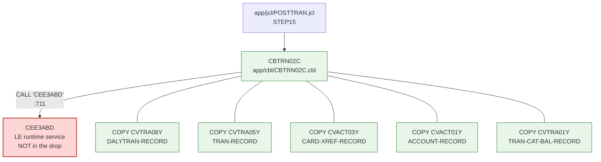

# Phase 1 — Inventory, dependency closure and validation scoping: POSTTRAN / CBTRN02C

Every statement below cites the file and line it was read from. Members not opened are marked
"not analyzed" rather than described.

---

## 1. Scope

### The drop

| Category | Count | Location |
|---|---|---|
| JCL | 29 | `app/jcl/` |
| PROC | 2 | `app/proc/` (`REPROC.prc`, `TRANREPT.prc`) |
| COBOL programs | 28 | `app/cbl/` |
| Copybooks | 28 | `app/cpy/` |
| BMS maps | 17 | `app/bms/` |
| Control cards | 1 | `app/ctl/REPROCT.ctl` |
| Catalog listing | 1 | `app/catlg/LISTCAT.txt` |
| Sample data | EBCDIC + ASCII | `app/data/EBCDIC/`, `app/data/ASCII/` |

### Selected unit: `app/jcl/POSTTRAN.jcl`, step `STEP15`, program `CBTRN02C`

`app/jcl/POSTTRAN.jcl:23` is `//STEP15 EXEC PGM=CBTRN02C`. The job has exactly one executable
step; there is no PROC invocation and no symbolic parameter to resolve in it, so the program and
all six dataset names are literal in the JCL (`app/jcl/POSTTRAN.jcl:23-42`).

Why this unit:

* It is a complete job stream, not a leaf utility: it reads a sequential input, does two keyed
  lookups, and **updates three** files plus a reject file (six `SELECT` clauses, `app/cbl/CBTRN02C.cbl:29-61`).
* It exercises every file-I/O shape in the drop that matters for parity — sequential input, KSDS
  random read, KSDS rewrite, KSDS insert, GDG sequential output.
* Its inputs are all present as delivered sample extracts (§5), so a baseline can actually be run
  locally today.
* It contains real business rules with reject paths (credit limit, expiry, referential lookups —
  `app/cbl/CBTRN02C.cbl:380-421`), which is what a validation loop needs to be worth running.

Rejected alternatives:

* `app/jcl/CREASTMT.JCL` — statement generation. It is a bigger job (IDCAMS + `PGM=SORT` +
  `CBSTM03A`, `app/jcl/CREASTMT.JCL:22-44`) but its application step depends on a SORT step whose
  behaviour is IBM's, not the drop's, and its outputs are formatted statement reports rather than
  updated master files — parity there measures report formatting, not posting arithmetic. Its
  closure is also two programs deep (`CBSTM03A.CBL:351` calls `CBSTM03B`), which adds surface
  without adding a new class of proof.
* `app/jcl/TRANREPT.jcl` (and the equivalent `app/proc/TRANREPT.prc`) — `PGM=SORT` at
  `app/jcl/TRANREPT.jcl:37` followed by `PGM=CBTRN03C` at `:59`. The first step is an IBM utility
  with nothing of ours to migrate, and `CBTRN03C` produces a printed report: presentation, not
  posting. It is the strongest second choice, and would be the natural next unit after this one
  — it is a genuine two-step stream, so it would prove step-to-step handoff, which this scope
  does not.
* `app/jcl/TRANFILE.jcl`, `app/jcl/XREFFILE.jcl`, `app/jcl/ACCTFILE.jcl`, `app/jcl/TCATBALF.jcl` —
  pure IDCAMS DEFINE/REPRO jobs (e.g. `app/jcl/ACCTFILE.jcl:36-61`). No
  application code to migrate; they are environment setup, and are used here as the authority for
  cluster geometry.
* `app/jcl/READACCT.jcl`, `app/jcl/READXREF.jcl`, `app/jcl/READCARD.jcl`, `app/jcl/READCUST.jcl` —
  leaf read-and-print utilities, explicitly deprioritized.

### Testing level this implies

This scope is **single-program parity** (`CBTRN02C`) run inside a **step harness** that reproduces
STEP15's DD wiring. Because `POSTTRAN` has exactly one executable step, the program boundary and
the job boundary coincide, so the harness is also the whole job.

What it therefore does **not** prove:

* No step-to-step handoff is exercised — there is none in this job. Multi-step handoff behaviour
  (e.g. `app/jcl/TRANREPT.jcl` SORT → report) is **not analyzed** and not proved.
* Nothing about the CICS/BMS online programs (`app/cbl/CO*.cbl`, `app/bms/`) — not analyzed.
* Nothing about GDG generation rolling: the harness writes one flat reject file, and MVS generation
  management is out of scope for a local emulator (§4).
* Nothing about the alternate index on the transaction master (`app/jcl/TRANIDX.jcl`,
  `app/catlg/LISTCAT.txt:3582` `AIX------AWS.M2.CARDDEMO.TRANSACT.VSAM.AIX`): `CBTRN02C` writes the
  base cluster only, and AIX upgrade is a VSAM function, not program logic.

---

## 2. Dependency graph



### Closure table

| Member | Type | Referenced by | Present? | Path |
|---|---|---|---|---|
| `CBTRN02C` | COBOL | `app/jcl/POSTTRAN.jcl:23` (`EXEC PGM=`) | yes | `app/cbl/CBTRN02C.cbl` |
| `CVTRA06Y` | copybook | `app/cbl/CBTRN02C.cbl:102` | yes | `app/cpy/CVTRA06Y.cpy` |
| `CVTRA05Y` | copybook | `app/cbl/CBTRN02C.cbl:107` | yes | `app/cpy/CVTRA05Y.cpy` |
| `CVACT03Y` | copybook | `app/cbl/CBTRN02C.cbl:112` | yes | `app/cpy/CVACT03Y.cpy` |
| `CVACT01Y` | copybook | `app/cbl/CBTRN02C.cbl:121` | yes | `app/cpy/CVACT01Y.cpy` |
| `CVTRA01Y` | copybook | `app/cbl/CBTRN02C.cbl:126` | yes | `app/cpy/CVTRA01Y.cpy` |
| `CEE3ABD` | compiler/runtime (LE service) | `app/cbl/CBTRN02C.cbl:711` | **no — and correctly so** | n/a; stubbed at `parity/tools/CEE3ABD.cbl` |

The program closure is **1 program deep**: `CBTRN02C` calls no application sub-programs. The
copybook closure is 5 members, all delivered. The only unresolved external is `CEE3ABD`, which is
an IBM Language Environment callable service, not a missing application member.

---

## 3. Second pass — what the first grep got wrong

A naive `grep -rn CALL app/cbl` over the drop returns matches that are **not** calls. Re-running
with column-7 comment filtering and literal/identifier discrimination over `CBTRN02C`:

| First-pass hit | Verdict on second pass |
|---|---|
| `app/cbl/CBTRN02C.cbl:7` `* Copyright Amazon.com, Inc.` | Comment (column 7 `*`). Only matched a case-insensitive scan; discarded. |
| `app/cbl/CBTRN02C.cbl:12` `* You may obtain a copy of the License at` | Comment, and matched only a case-insensitive `COPY` scan. Discarded — a case-insensitive `COPY` grep over this drop produces one false positive per source member, because every member carries the same Apache header. |
| `CA-CALL-CONTEXT` (`app/cbl/COACTVWC.cbl:214`, `app/cbl/COCRDSLC.cbl:201`) | Substring of a data name, not a verb. Discarded. |
| `* CALL MENU PROGRAM` style comments (other members) | Comment. Discarded. |
| `app/cbl/CBTRN02C.cbl:711` `CALL 'CEE3ABD'` | **Real** — the only CALL in the in-scope program. |

Further second-pass checks:

* **Dynamic calls:** `CBTRN02C` has no `CALL identifier` form; the single call target is a literal
  (`app/cbl/CBTRN02C.cbl:711`). Widening the check to the whole drop, a scan for non-comment lines
  containing `CALL ` without a following quote returns exactly one hit,
  `app/cbl/CSUTLDTC.cbl:116` `CALL "CEEDAYS"` — a double-quoted literal, not an identifier. **There
  are no dynamic calls anywhere in this drop**, so nothing needs to be flagged as statically
  unclosable. (An earlier pass of this analysis asserted that `CBSTM03A.CBL` used data-name call
  targets; that was wrong — all ten of its calls are the literal `'CBSTM03B'`,
  `app/cbl/CBSTM03A.CBL:351` and following. The scope rationale in §1 has been corrected
  accordingly.)
* **Assembler members:** none in the closure. `app/cbl/` contains only COBOL; there is no
  assembler source directory in the drop, so any assembler utility in the real environment is by
  definition absent and would have to be stubbed. None is referenced from this scope.
* **Compiler/runtime vs. application routines:** `CEE3ABD` is classified as an LE runtime service
  (supplied by the system, invoked to terminate the enclave), not an application module. It is not
  reported as a missing deliverable, but it *is* reported as something the emulator must stub —
  both statements matter and neither is dropped.
* **Nested COPYs:** each of the five copybooks was opened and scanned for further `COPY` statements
  outside column-7 comments. There are none; the copybook closure is flat.
* **SQL INCLUDEs:** `EXEC SQL` does not appear anywhere in `app/cbl/`. This scope is a
  VSAM/file program, not a DB2 program, so there is no SQLCA question to answer.

### Cross-validation against an independent inventory

`app/catlg/LISTCAT.txt` is a catalog listing produced by the source system — an inventory of the
data layer that was not derived from the source code. Comparing it to what the program and the
IDCAMS jobs claim:

| Object | From JCL/COBOL | From `app/catlg/LISTCAT.txt` | Agreement |
|---|---|---|---|
| `ACCTDATA.VSAM.KSDS` | `KEYS(11 0)`, `RECORDSIZE(300 300)` (`app/jcl/ACCTFILE.jcl:40-41`); `ACCOUNT-RECORD` 300 bytes with `ACCT-ID PIC 9(11)` first (`app/cpy/CVACT01Y.cpy:5-17`) | `KEYLEN 11`, `RKP 0`, `MAXLRECL 300` (`:59-60`) | exact |
| `CARDXREF.VSAM.KSDS` | `KEYS(16 0)`, `RECORDSIZE(50 50)` (`app/jcl/XREFFILE.jcl:43-44`); `CARD-XREF-RECORD` 50 bytes keyed on `XREF-CARD-NUM PIC X(16)` (`app/cpy/CVACT03Y.cpy:5-8`) | `KEYLEN 16`, `RKP 0`, `MAXLRECL 50` (`:403-404`) | exact |
| `TCATBALF.VSAM.KSDS` | `KEYS(17 0)`, `RECORDSIZE(50 50)` (`app/jcl/TCATBALF.jcl:40-41`); `TRAN-CAT-KEY` = 11+2+4 = 17 bytes (`app/cpy/CVTRA01Y.cpy:5-8`) | `KEYLEN 17`, `RKP 0`, `MAXLRECL 50` (`:1371-1372`) | exact |
| `TRANSACT.VSAM.KSDS` | `RECORDSIZE(350 350) KEYS(16 0)` (`app/jcl/TRANFILE.jcl:53-54`); `TRAN-RECORD` 350 bytes keyed on `TRAN-ID PIC X(16)` (`app/cpy/CVTRA05Y.cpy:5-18`) | `KEYLEN 16`, `RKP 0`, `MAXLRECL 350` (`:3593-3594`) | exact |
| `DALYREJS` | GDG base, `LIMIT(5)`, `SCRATCH` (`app/jcl/DALYREJS.jcl:24-28`) | `GDG BASE`, `LIMIT 5`, `SCRATCH NOEMPTY LIFO` with generations G0022V00–G0026V00 catalogued (`:684-696`) | exact, plus five surviving generations |
| Transaction AIX | defined by `app/jcl/TRANIDX.jcl` | `AIX------AWS.M2.CARDDEMO.TRANSACT.VSAM.AIX` (`:3582`) | exact |

Discrepancies, and what they mean:

* `app/catlg/LISTCAT.txt:1376` reports `REC-TOTAL 100` for `TCATBALF.VSAM.KSDS`. The local baseline
  run of `CBTRN02C` over the delivered sample produces exactly 100 records (50 seeded + 50
  created) — independent corroboration that the delivered sample data and the catalog come from
  the same lineage.
* `app/catlg/LISTCAT.txt:3598` reports `REC-TOTAL 311` for `TRANSACT.VSAM.KSDS`, whereas the
  baseline run posts 262. This is **not** an overlooked callee; the transaction master is written
  by several jobs (`app/jcl/TRANFILE.jcl:74` REPRO-loads it from `DALYTRAN.PS.INIT`;
  `app/jcl/COMBTRAN.jcl:46` and `app/jcl/TRANBKP.jcl:27,40-66` also allocate or redefine it), and the catalog is a
  point-in-time snapshot of a cumulative state, not of one `POSTTRAN` run. Attributing the
  difference precisely requires the baseline job log, which the drop does not contain — see §5.
* `app/catlg/LISTCAT.txt:67` reports `REC-UPDATED 311` on the account cluster, again cumulative
  across jobs, not per-run. Not analyzed further.

---

## 4. JCL / data layer (separate pass)

### Control cards

`STEP15` has **no SYSIN and no control card of any kind** (`app/jcl/POSTTRAN.jcl:23-42`). The
drop's single control-card member `app/ctl/REPROCT.ctl` is consumed by `app/proc/REPROC.prc:28`
(`DSN=&CNTLLIB(REPROCT)`), which is not part of this scope — not analyzed further.

### DD wiring vs. SELECT ... ASSIGN

| DD (POSTTRAN.jcl) | DSN | SELECT / ASSIGN | Org & record | Copybook layout |
|---|---|---|---|---|
| `STEPLIB` (:24) | `AWS.M2.CARDDEMO.LOADLIB` | **no SELECT** | PDS load library | n/a — JCL-layer only |
| `SYSPRINT` (:26) | `SYSOUT=*` | **no SELECT** | spool | n/a — LE/runtime messages |
| `SYSOUT` (:27) | `SYSOUT=*` | **no SELECT** | spool | destination of every `DISPLAY` (e.g. `app/cbl/CBTRN02C.cbl:194`, `:227-232`) |
| `TRANFILE` (:28) | `...TRANSACT.VSAM.KSDS` | `SELECT TRANSACT-FILE ASSIGN TO TRANFILE` (`:34-39`) | KSDS, key 16 @0, LRECL 350 | `CVTRA05Y` `TRAN-RECORD` |
| `DALYTRAN` (:30) | `...DALYTRAN.PS` | `SELECT DALYTRAN-FILE ASSIGN TO DALYTRAN` (`:29-33`) | sequential, LRECL 350 | `CVTRA06Y` `DALYTRAN-RECORD` |
| `XREFFILE` (:32) | `...CARDXREF.VSAM.KSDS` | `SELECT XREF-FILE ASSIGN TO XREFFILE` (`:40-44`) | KSDS, key 16 @0, LRECL 50 | `CVACT03Y` `CARD-XREF-RECORD` |
| `DALYREJS` (:34) | `...DALYREJS(+1)` | `SELECT DALYREJS-FILE ASSIGN TO DALYREJS` (`:46-49`) | sequential, `RECFM=F,LRECL=430` (`:36`) | `REJECT-RECORD` = 350 + 80 (`app/cbl/CBTRN02C.cbl:176-178`) |
| `ACCTFILE` (:39) | `...ACCTDATA.VSAM.KSDS` | `SELECT ACCOUNT-FILE ASSIGN TO ACCTFILE` (`:51-55`) | KSDS, key 11 @0, LRECL 300 | `CVACT01Y` `ACCOUNT-RECORD` |
| `TCATBALF` (:41) | `...TCATBALF.VSAM.KSDS` | `SELECT TCATBAL-FILE ASSIGN TO TCATBALF` (`:57-61`) | KSDS, key 17 @0, LRECL 50 | `CVTRA01Y` `TRAN-CAT-BAL-RECORD` |

* **DDs with no SELECT:** `STEPLIB`, `SYSPRINT`, `SYSOUT` — all three are system DDs, expected.
* **SELECTs with no DD:** none. All six SELECTs are wired.
* **DUMMY DDs:** none. Every data DD is live.
* The reject LRECL in the JCL (430, `:36`) matches the COBOL FD exactly (350 + 80,
  `app/cbl/CBTRN02C.cbl:83-84`) — a real cross-layer agreement, not an assumption.

### Dataset lineage

| Dataset | Origin |
|---|---|
| `DALYTRAN.PS` | external to the job — no step in any delivered JCL produces it. (`app/jcl/TRANFILE.jcl:70` uses the separate `DALYTRAN.PS.INIT` dataset, not this one.) |
| `CARDXREF.VSAM.KSDS` | produced by `app/jcl/XREFFILE.jcl` (`DEFINE CLUSTER` :39-47, `REPRO` from `CARDXREF.PS` :64). Read-only here. |
| `ACCTDATA.VSAM.KSDS` | produced by `app/jcl/ACCTFILE.jcl` (`DEFINE CLUSTER` :36-44, `REPRO` from `ACCTDATA.PS` :61). **Updated** here. |
| `TCATBALF.VSAM.KSDS` | produced by `app/jcl/TCATBALF.jcl` (`DEFINE CLUSTER` :36-44, `REPRO` from `TCATBALF.PS` :61). **Updated** here. |
| `TRANSACT.VSAM.KSDS` | defined and REPRO-loaded by `app/jcl/TRANFILE.jcl` (`DEFINE CLUSTER` :49-57, `REPRO` :74, AIX :80-90); a further AIX job exists at `app/jcl/TRANIDX.jcl`. `CBTRN02C` does `OPEN OUTPUT` on it (`app/cbl/CBTRN02C.cbl:256`), i.e. it **replaces** the cluster contents. |
| `DALYREJS(+1)` | created by this step; GDG base defined by `app/jcl/DALYREJS.jcl:24-28`. |

### GDG implications for rerun

`DALYREJS` is referenced as `(+1)` with `DISP=(NEW,CATLG,DELETE)` (`app/jcl/POSTTRAN.jcl:34-38`)
over a base with `LIMIT(5) SCRATCH` (`app/jcl/DALYREJS.jcl:26-27`). Every successful rerun
therefore creates a new generation and, past five, scratches the oldest — so *reruns are not
idempotent at the data layer* and a baseline extract must name the generation it came from. On the
migration side this becomes a plain output file; generation rolling is an operational concern, not
program logic.

`OPEN OUTPUT` on `TRANFILE` (`app/cbl/CBTRN02C.cbl:256`) means a rerun starts the transaction
master from empty. A rerun after a partial failure is therefore safe for `TRANFILE` but **not** for
`ACCTFILE`/`TCATBALF`, which are updated in place and would be double-posted.

### PARM

`STEP15` passes **no PARM** (`app/jcl/POSTTRAN.jcl:23` — the `EXEC` has no `PARM=`), and
`CBTRN02C` has **no LINKAGE SECTION and no `PROCEDURE DIVISION USING`**: the division header is
bare at `app/cbl/CBTRN02C.cbl:193`. There is consequently no code that validates or branches on a
PARM. Nothing to pass through in the harness, and nothing to request from the source team.

---

## 5. What the validation loop needs

### Needed from the source-system side

1. `AWS.M2.CARDDEMO.DALYTRAN.PS` as used for the baseline run — **already in the drop**
   (`app/data/EBCDIC/AWS.M2.CARDDEMO.DALYTRAN.PS`, 105,000 bytes = 300 × 350).
2. Before-images of all three keyed inputs, from the same run: `CARDXREF`, `ACCTDATA`, `TCATBALF`.
   Sequential extracts of all three are in the drop (`app/data/EBCDIC/*.PS`, 50 records each), but
   they are the *initial load* images REPROed by `app/jcl/XREFFILE.jcl:64` etc., **not** proven to be
   the before-images of any particular production run.
3. Known-good outputs from one baseline run, paired to that run:
   * `DALYREJS` generation contents (and *which* generation) — **missing**;
   * `TRANSACT.VSAM.KSDS` after-image (IDCAMS REPRO unload) — **missing**;
   * `ACCTDATA.VSAM.KSDS` after-image — **missing**;
   * `TCATBALF.VSAM.KSDS` after-image — **missing**;
   * the job's SYSOUT, which carries the two trailer counts and the per-key "Creating." lines
     (`app/cbl/CBTRN02C.cbl:227-228`, `:476-477`) — **missing**.
4. PARM values — **not applicable**, the step has none (§4).
5. A delivery channel: this repository. Suggested location `parity/baseline/<run-id>/`, raw
   untranslated dumps, one directory per run.

### Needed on the migration side

* **Emulator compile of the full tree** — done, see §6.
* **Stubs:** `CEE3ABD` only (`parity/tools/CEE3ABD.cbl`). No assembler utilities, no DB2, no CICS
  in this scope.
* **Format converters per copybook:** `parity/tools/decode_ebcdic.py` (CP037 → single-byte ASCII,
  preserving zoned sign overpunches) plus `parity/tools/VSAMLOAD.cbl` /
  `parity/tools/VSAMUNLD.cbl`, which convert between flat 350/300/50-byte images and GnuCOBOL
  INDEXED files matching the KSDS keys.
* **Normalization + diff harness:** `parity/tools/diff_outputs.py`. It masks exactly one field,
  `TRAN-PROC-TS`, which is taken from `FUNCTION CURRENT-DATE` at run time
  (`app/cbl/CBTRN02C.cbl:693`) and can never be equal between two runs; it is instead asserted
  to match the DB2 timestamp format the paragraph builds. Everything else is compared byte for
  byte, sign overpunches included.
* **Step harness reproducing the DD wiring:** `parity/run_legacy.sh` for the baseline and
  `PostTranMain` for the migration; both take the same DD-named environment variables. No PARM
  passthrough is needed (§4).

### What the drop already contains vs. what is missing

| Artifact | Status |
|---|---|
| Daily transaction input | present (`app/data/EBCDIC/AWS.M2.CARDDEMO.DALYTRAN.PS`) |
| XREF / account / category-balance seeds | present (`app/data/EBCDIC/*.PS`), but as initial-load images |
| Baseline outputs and after-images | **missing** |
| Baseline SYSOUT / job log | **missing** |
| PARM values | not applicable |
| Independent data-layer inventory | present (`app/catlg/LISTCAT.txt`) |
| Reject-path coverage in the sample | **partial** — see the verdict |

### Intake checklist (ordered by cost of failure)

1. **Encoding integrity.** Confirm the extracts are raw, untranslated dumps. Decode against the
   copybooks and check: every signed zoned field ends in `{A-I}` / `}J-R` (or the EBCDIC
   equivalent) — `ACCT-CURR-BAL`, `ACCT-CREDIT-LIMIT`, `ACCT-CASH-CREDIT-LIMIT`,
   `ACCT-CURR-CYC-CREDIT`, `ACCT-CURR-CYC-DEBIT` (`app/cpy/CVACT01Y.cpy:7-14`), `DALYTRAN-AMT`
   (`app/cpy/CVTRA06Y.cpy:10`), `TRAN-CAT-BAL` (`app/cpy/CVTRA01Y.cpy:9`); file length is an exact
   multiple of the LRECL. This drop passes: `parity/tools/decode_ebcdic.py` asserts the multiples,
   and the run reproduces sign characters end to end. An ASCII-translated extract silently destroys
   these fields, so this is checked first.
2. **Completeness of the parity set.** Inputs, before-images of `ACCTFILE`/`TCATBALF`/`XREFFILE`,
   the `DALYREJS` generation, the `TRANSACT` after-image, `ACCTDATA` and `TCATBALF` after-images,
   and the SYSOUT — all from one run, in one directory.
3. **Run parameters.** No PARM exists here, so the only run metadata needed is: which `DALYREJS`
   generation the run produced, and the job's start timestamp (to sanity-check `TRAN-PROC-TS`).
4. **Baseline mode consistency.** The baseline must not have run with any subsystem stubbed that
   the migrated run treats differently. For this program the only external is `CEE3ABD`, reached
   only on an abend; if the baseline abended, its outputs are partial and unusable for parity —
   confirm the baseline ended with RC 0 or RC 4 (`app/cbl/CBTRN02C.cbl:229-231`).
5. **Branch coverage.** The sample must exercise rejects. The delivered sample produces reject
   reason 102 only (38 of 300 records); reasons 100, 101, 103 and 109
   (`app/cbl/CBTRN02C.cbl:385`, `:397`, `:417`, `:556`) are never reached. Ask for an extract that contains
   a card number absent from `CARDXREF`, an XREF row pointing at an absent account, and a
   transaction dated after `ACCT-EXPIRAION-DATE`.
6. **Internal consistency.** `TRANSACTIONS PROCESSED` must equal the input record count and
   `TRANSACTIONS REJECTED` the `DALYREJS` record count (`app/cbl/CBTRN02C.cbl:227-228`); spot-check
   one account through before-image → transaction amount → after-image, using
   `ACCT-CURR-BAL += DALYTRAN-AMT` (`app/cbl/CBTRN02C.cbl:547`).

---

## 6. Emulator compile result

GnuCOBOL 3.1.2 (`cobc`), from `parity/run_legacy.sh`:

```
cobc -x -std=ibm -fsign=EBCDIC -I app/cpy -o CBTRN02C app/cbl/CBTRN02C.cbl
```

Compiles clean — no errors, no missing copybooks: mechanical confirmation that the copybook
closure in §2 is complete. `CEE3ABD` resolves dynamically at run time and so does not break the
link; it is stubbed by `parity/tools/CEE3ABD.cbl` for the abend path.

Two findings worth recording:

* **`-fsign=EBCDIC` is required, not cosmetic.** Compiled with GnuCOBOL's default ASCII sign
  handling, the program writes signed zoned fields with a different low-order byte than the
  delivered data uses, and — because `ACCT-CURR-CYC-CREDIT`/`-DEBIT` are then read back
  differently — the run produces 43 rejects and 257 posted transactions instead of 38 and 262. The
  sign convention changes the *results*, not just the bytes.
* The baseline run over the delivered sample: 300 transactions processed, 38 rejected, RC 4
  (`app/cbl/CBTRN02C.cbl:229-231`), 262 records in the transaction master, 100 in the category
  balance file, 50 accounts updated in place.

---

## 7. Exact list of artifacts to request from the source-system team

For **one** `POSTTRAN` run, delivered into `parity/baseline/<run-id>/` in this repo as raw
untranslated dumps:

1. `AWS.M2.CARDDEMO.DALYTRAN.PS` — the exact input of that run.
2. IDCAMS REPRO unloads taken **before** the run: `CARDXREF.VSAM.KSDS`, `ACCTDATA.VSAM.KSDS`,
   `TCATBALF.VSAM.KSDS`.
3. IDCAMS REPRO unloads taken **after** the run: `TRANSACT.VSAM.KSDS`, `ACCTDATA.VSAM.KSDS`,
   `TCATBALF.VSAM.KSDS`.
4. The `AWS.M2.CARDDEMO.DALYREJS` generation the run created, named with its `GnnnnV00` suffix.
5. The job's SYSOUT/joblog, including the step return code.
6. A second run (or a second input extract) that exercises reject reasons 100, 101 and 103, with
   the same six artifacts.

No PARM values are needed; the step has none.

---

## 8. Verdict

**No — the drop is not complete enough to run a full parity loop against the source system.**

What is missing is exactly one class of artifact: **known-good baseline outputs**. There is no
after-image of `TRANSACT`, `ACCTDATA` or `TCATBALF`, no `DALYREJS` generation content, and no job
log from any mainframe run of `POSTTRAN` (§5). Without them, "parity" can only be measured against
a locally produced baseline, not against the source system.

What *is* possible today, and was done in Phase 2:

* The unmodified COBOL runs under GnuCOBOL on the delivered sample data, producing a complete,
  reproducible local baseline (§6). The migrated code is diffed byte for byte against that
  baseline across all four outputs plus SYSOUT.
* This proves the migration is faithful to *the program as compiled*, on the data paths the sample
  exercises. It does **not** prove agreement with z/OS itself — differences in the runtime's
  numeric edge cases, VSAM status codes, or LE behaviour would go undetected.

Behaviours that could not be validated against any baseline, and are covered by source-derived
functional tests instead (`migration/posttran-java/src/test/.../PostTranJobTest.java`):

| Behaviour | Cited source | Why no parity |
|---|---|---|
| Reject 100, invalid card number | `app/cbl/CBTRN02C.cbl:383-388` | sample contains no unknown card |
| Reject 101, account not found | `app/cbl/CBTRN02C.cbl:395-400` | every XREF row resolves in the sample |
| Reject 103, transaction after expiry | `app/cbl/CBTRN02C.cbl:414-420` | no expired account in the sample |
| Reject 109, account rewrite invalid key | `app/cbl/CBTRN02C.cbl:554-559` | unreachable once 101 has passed, with this data |
| Negative amount → `ACCT-CURR-CYC-DEBIT` | `app/cbl/CBTRN02C.cbl:548-552` | sample amounts are all positive |
| Abend on a failed `TRANFILE` write | `app/cbl/CBTRN02C.cbl:562-579`, `:707-711` | not reachable with valid data |
| Credit-limit boundary (`>=`, exactly at limit posts) | `app/cbl/CBTRN02C.cbl:407` | boundary value not present in the sample |

---

## 9. Phase 2 summary

Target stack: **Java 17 (Maven)**. The repo contains no modern stack to inherit — `app/` is COBOL,
JCL, BMS and data only — so this is a chosen mainstream target. Java is picked over the
alternatives because `BigDecimal` models COBOL fixed-point arithmetic (`PIC S9(9)V99`) exactly,
which a float-based stack cannot, and because the JVM's byte-level control makes reproducing
fixed-length records with zoned sign overpunches straightforward.

Layout:

* `migration/posttran-java/` — the migration. `PostTranJob` mirrors the COBOL paragraph names
  one-for-one, `Layouts` transcribes the copybook offsets, `Zoned` implements the zoned-decimal
  codec, `PostTranMain` is the step harness.
* `parity/` — the loop: `run_legacy.sh` (unmodified COBOL under GnuCOBOL), `run_parity.sh`
  (both sides + diff), `tools/` (converters, stub, diff harness).

The legacy source under `app/` is unchanged.

Parity result over the delivered sample (`parity/run_parity.sh`):

```
PASS TRANSACT.after: 262 records identical
PASS ACCTDATA.after: 50 records identical
PASS TCATBALF.after: 100 records identical
PASS DALYREJS.dat: 38 records identical
PASS SYSOUT.txt: 55 lines identical
PARITY: PASS
```

Plus 11 source-derived functional tests for the branches above (`mvn test`).
