# Batch Flow Documentation

This documents all **36 JCL members** in [`app/jcl/`](../app/jcl/). Each job is described by its
purpose, the program(s) it executes (`EXEC PGM=`), and its principal input/output datasets. The
recommended end-to-end execution sequence (from `README.md`, "Running Batch Jobs") is shown as a
Mermaid diagram at the end.

Utility program legend: **IDCAMS** = VSAM define/repro/delete; **IEBGENER** = copy sequential;
**IEFBR14** = null/allocate; **SDSF** = issue CICS/console command; **SORT/DFSORT** = sort/merge;
**DFHCSDUP** = CICS CSD update; **DSNTEP4/DSNTIAUL** = Db2 SQL/unload.

---

## Job catalog

| JCL | Main program(s) | Purpose | Key inputs → outputs |
|:----|:----------------|:--------|:---------------------|
| ACCTFILE.jcl | IDCAMS | Refresh/load Account master KSDS | `acctdata.ps` → `ACCTDATA.VSAM.KSDS` |
| CARDFILE.jcl | SDSF, IDCAMS | Close in CICS, refresh Card master + AIX | `carddata.ps` → `CARDDATA.VSAM.KSDS` (+AIX) |
| CUSTFILE.jcl | SDSF, IDCAMS | Refresh Customer master KSDS | `custdata.ps` → `CUSTDATA.VSAM.KSDS` |
| XREFFILE.jcl | IDCAMS | Load card/account/customer xref + AIX | `cardxref.ps` → `CARDXREF.VSAM.KSDS` (+AIX) |
| DISCGRP.jcl | IDCAMS | Load disclosure-group (interest rates) KSDS | `discgrp.ps` → `DISCGRP.VSAM.KSDS` |
| TCATBALF.jcl | IDCAMS | Refresh Transaction-Category-Balance KSDS | `tcatbal.ps` → `TCATBALF.VSAM.KSDS` |
| TRANFILE.jcl | SDSF, IDCAMS | Build Transaction master KSDS + AIX | `dailytran.ps` → `TRANSACT.VSAM.KSDS` |
| TRANCATG.jcl | IDCAMS | Load Transaction-category lookup KSDS | `trancatg.ps` → `TRANCATG.VSAM.KSDS` |
| TRANTYPE.jcl | IDCAMS | Load Transaction-type lookup KSDS | `trantype.ps` → `TRANTYPE.VSAM.KSDS` |
| DUSRSECJ.jcl | IEBGENER, IDCAMS | Initial load of user-security KSDS | `usrsec.ps` → `USRSEC.VSAM.KSDS` |
| DEFCUST.jcl | IDCAMS | Define Customer KSDS cluster | — → empty `CUSTDATA.VSAM.KSDS` |
| DEFGDGB.jcl | IDCAMS | Define GDG base(s) | — → GDG bases |
| DEFGDGD.jcl | IDCAMS, IEBGENER | Define extra GDG bases (Db2 path) | — → GDG bases |
| ESDSRRDS.jcl | IEFBR14, IEBGENER, IDCAMS | Demo: define ESDS & RRDS clusters | sample → ESDS/RRDS |
| REPTFILE.jcl | IDCAMS | Define report output file | — → report dataset |
| DALYREJS.jcl | IDCAMS | Define daily-reject dataset | — → `DALYREJS` |
| **POSTTRAN.jcl** | **CBTRN02C** | **Post daily transactions, update balances** | `DALYTRAN`, `XREFFILE`, `ACCTFILE`, `TCATBALF` → `TRANSACT`, `DALYREJS` |
| **INTCALC.jcl** | **CBACT04C** | **Calculate monthly interest, write interest tx** | `TCATBALF`, `XREFFILE`, `ACCTFILE`, `DISCGRP` → `ACCTFILE`(upd), `TRANSACT` |
| TRANBKP.jcl | IDCAMS (REPROC proc) | Backup/refresh Transaction master | `TRANSACT.VSAM.KSDS` → backup PS |
| COMBTRAN.jcl | SORT, IDCAMS | Combine system + daily transactions | system tx + daily → combined `TRANSACT` |
| CREASTMT.JCL | IDCAMS, SORT, IEFBR14, CBSTM03A | Produce account statements | `TRANSACT`,`XREF`,`CUST`,`ACCT` → `STMTFILE`, `HTMLFILE` |
| TRANREPT.jcl | SORT, CBTRN03C | Transaction detail report | `TRANSACT`, `TRANTYPE`, `TRANCATG`, `DATEPARM` → `TRANREPT` |
| PRTCATBL.jcl | IEFBR14, REPROC, SORT | Print transaction-category-balance file | `TCATBALF` → printed listing |
| TRANIDX.jcl | IDCAMS | Define alternate index on transaction file | `TRANSACT.VSAM.KSDS` → AIX/PATH |
| READACCT.jcl | IEFBR14, CBACT01C | Read & print Account master | `ACCTFILE` → listing |
| READCARD.jcl | CBACT02C | Read & print Card master | `CARDFILE` → listing |
| READCUST.jcl | CBCUS01C | Read & print Customer master | `CUSTFILE` → listing |
| READXREF.jcl | CBACT03C | Read & print Card xref | `XREFFILE` → listing |
| CLOSEFIL.jcl | SDSF | Close VSAM files held open by CICS | CICS command |
| OPENFIL.jcl | SDSF | Open/enable VSAM files in CICS | CICS command |
| WAITSTEP.jcl | COBSWAIT | Wait/sleep a fixed interval between jobs | PARM (centiseconds) |
| CBADMCDJ.jcl | DFHCSDUP | Update CICS CSD (resource definitions) | CSD updates |
| INTRDRJ1.JCL | IDCAMS, IEBGENER | Internal-reader helper (submit jobs) | → internal reader |
| INTRDRJ2.JCL | IDCAMS | Internal-reader helper (submit jobs) | → internal reader |
| FTPJCL.JCL | FTP | FTP transfer helper | local ↔ remote |
| TXT2PDF1.JCL | (REXX/utility) | Convert text report to PDF | text → PDF |

> Optional-module jobs referenced in the README (`CREADB21` Db2 load, `TRANEXTR` Db2 unload,
> `CBPAUP0J` IMS/MQ purge) are **not present** in this `app/jcl/` directory and are out of scope.

---

## Featured jobs

### INTCALC.jcl → CBACT04C (interest calculation) ⭐

```jcl
//STEP15   EXEC PGM=CBACT04C,PARM='2022071800'
//TCATBALF DD DSN=AWS.M2.CARDDEMO.TCATBALF.VSAM.KSDS,DISP=SHR   (in,  sequential driver)
//XREFFILE DD DSN=AWS.M2.CARDDEMO.CARDXREF.VSAM.KSDS,DISP=SHR   (in,  random via AIX)
//ACCTFILE DD DSN=AWS.M2.CARDDEMO.ACCTDATA.VSAM.KSDS,DISP=SHR   (in/out, random + rewrite)
//DISCGRP  DD DSN=AWS.M2.CARDDEMO.DISCGRP.VSAM.KSDS,DISP=SHR    (in,  random)
//TRANSACT DD DSN=AWS.M2.CARDDEMO.SYSTRAN.VSAM.KSDS(+1),...     (out, sequential, new GDG)
```

- **PARM** `2022071800` is the processing date/time (`YYYYMMDDHH`) used to timestamp generated
  interest transactions. This is the `processingDate` job parameter in the
  [modernized Spring Batch job](../modernized/).
- See [dependency-graph.md](dependency-graph.md#5-cbact04c-focus-the-transpiled-program) for the
  file/copybook footprint and the COBOL→Java mapping.

### POSTTRAN.jcl → CBTRN02C (transaction posting)

Posts the daily transaction file: validates each record against the xref and account masters, writes
accepted records to the transaction master and rejects to `DALYREJS`, and updates `ACCTFILE`
balances and `TCATBALF` category balances. INTCALC normally runs **after** POSTTRAN so interest is
computed on the freshly posted balances.

---

## Recommended execution sequence

The README prescribes this ordering for a full batch cycle. Setup/refresh jobs load the VSAM master
files; the core processing jobs (POSTTRAN → INTCALC) then run; finally backup/statement/report jobs
produce outputs, and OPENFIL re-enables the files in CICS.

```mermaid
flowchart TD
    CLOSEFIL[CLOSEFIL<br/>close files in CICS] --> ACCTFILE[ACCTFILE<br/>load accounts]
    ACCTFILE --> CARDFILE[CARDFILE<br/>load cards]
    CARDFILE --> XREFFILE[XREFFILE<br/>load xref]
    XREFFILE --> CUSTFILE[CUSTFILE<br/>load customers]
    CUSTFILE --> TRANBKP1[TRANBKP<br/>build tran master]
    TRANBKP1 --> TRANCATG[TRANCATG<br/>load tran categories]
    TRANCATG --> TRANTYPE[TRANTYPE<br/>load tran types]
    TRANTYPE --> DISCGRP[DISCGRP<br/>load disclosure groups]
    DISCGRP --> TCATBALF[TCATBALF<br/>load category balances]
    TCATBALF --> DUSRSECJ[DUSRSECJ<br/>load user security]
    DUSRSECJ --> POSTTRAN[POSTTRAN / CBTRN02C<br/>post transactions]
    POSTTRAN --> INTCALC[INTCALC / CBACT04C<br/>calculate interest]
    INTCALC --> TRANBKP2[TRANBKP<br/>backup tran master]
    TRANBKP2 --> COMBTRAN[COMBTRAN<br/>combine system+daily tx]
    COMBTRAN --> CREASTMT[CREASTMT / CBSTM03A<br/>produce statements]
    CREASTMT --> TRANIDX[TRANIDX<br/>define tran AIX]
    TRANIDX --> OPENFIL[OPENFIL<br/>open files in CICS]
    OPENFIL --> WAITSTEP[WAITSTEP<br/>optional wait]

    style POSTTRAN fill:#cde4ff,stroke:#1b4f9c
    style INTCALC fill:#cde4ff,stroke:#1b4f9c
```



> `COND=` parameters on multi-step jobs (e.g. CREASTMT, TRANBKP, DEFGDGD) implement conditional
> step execution — a step is skipped/run depending on prior step return codes — the JCL analogue of
> `if RC == 0` gating. The modernized job replaces JCL step sequencing + `COND` with Spring Batch
> step flow control.
</content>
