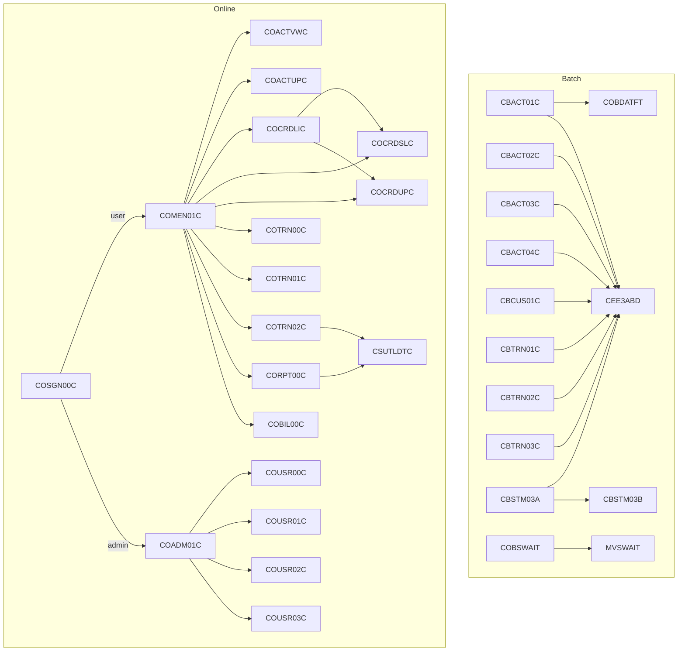
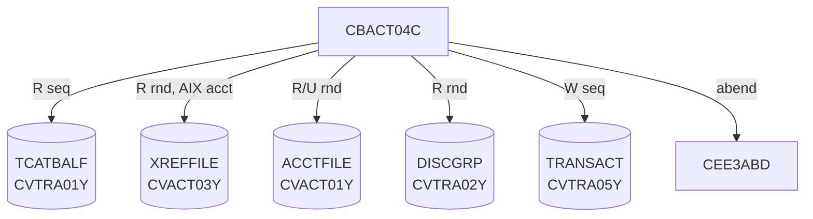

# Dependency Graph

Derived from a static scan of all 29 programs in [`app/cbl/`](../app/cbl/) for `COPY`, `CALL`,
`EXEC CICS XCTL`/`LINK`, and file I/O (`SELECT … ASSIGN`, CICS file names). External LE/runtime
modules (`CEE3ABD`, `COBDATFT`, `MVSWAIT`) are shown where called.

---

## 1. Program-to-program call graph

CardDemo has two call styles:

- **Batch / subroutine:** static or dynamic `CALL`.
- **CICS online:** `EXEC CICS XCTL PROGRAM(...)` where the target is taken at runtime from the
  commarea (`CDEMO-TO-PROGRAM`) or from a menu-options table (`COMEN02Y` / `COADM02Y`). The edges
  below reflect those table entries and the signon routing logic.

> Every online program can also `XCTL` back to the caller stored in `CDEMO-FROM-PROGRAM`
> (e.g. return to the menu), and to `COSGN00C` on signoff. Those generic return edges are omitted
> for readability.

---

## 2. Program-to-file dependency map

Logical DD/CICS file names; see [program-inventory.md](program-inventory.md#logical-file--dataset-reference)
for the dataset mapping. `(R)` read, `(W)` write, `(U)` update/rewrite.

```mermaid
graph LR
    %% Batch
    CBACT01C -->|R| ACCTFILE
    CBACT02C -->|R| CARDFILE
    CBACT03C -->|R| XREFFILE
    CBCUS01C -->|R| CUSTFILE

    CBACT04C -->|R| TCATBALF
    CBACT04C -->|R| XREFFILE
    CBACT04C -->|RU| ACCTFILE
    CBACT04C -->|R| DISCGRP
    CBACT04C -->|W| TRANSACT

    CBTRN01C -->|R| DALYTRAN
    CBTRN01C -->|R| CUSTFILE
    CBTRN01C -->|R| XREFFILE
    CBTRN01C -->|R| CARDFILE
    CBTRN01C -->|R| ACCTFILE
    CBTRN01C -->|W| TRANSACT

    CBTRN02C -->|R| DALYTRAN
    CBTRN02C -->|W| TRANSACT
    CBTRN02C -->|R| XREFFILE
    CBTRN02C -->|RU| ACCTFILE
    CBTRN02C -->|RU| TCATBALF
    CBTRN02C -->|W| DALYREJS

    CBTRN03C -->|R| TRANFILE
    CBTRN03C -->|R| XREFFILE
    CBTRN03C -->|R| TRANTYPE
    CBTRN03C -->|R| TRANCATG

    CBSTM03A -->|W| STMTFILE
    CBSTM03A -->|W| HTMLFILE
    CBSTM03B -->|R| TRNXFILE
    CBSTM03B -->|R| XREFFILE
    CBSTM03B -->|R| CUSTFILE
    CBSTM03B -->|R| ACCTFILE

    %% Online
    COSGN00C -->|R| USRSEC
    COMEN01C -->|R| USRSEC
    COADM01C -->|R| USRSEC
    COUSR00C -->|R| USRSEC
    COUSR01C -->|W| USRSEC
    COUSR02C -->|RU| USRSEC
    COUSR03C -->|RD| USRSEC

    COACTVWC -->|R| ACCTDAT
    COACTVWC -->|R| CUSTDAT
    COACTVWC -->|R| CARDDAT
    COACTUPC -->|RU| ACCTDAT
    COACTUPC -->|RU| CUSTDAT
    COCRDLIC -->|R| CARDDAT
    COCRDSLC -->|R| CARDDAT
    COCRDUPC -->|RU| CARDDAT
    COTRN00C -->|R| TRANSACT
    COTRN01C -->|R| TRANSACT
    COTRN02C -->|R| ACCTDAT
    COTRN02C -->|R| CCXREF
    COTRN02C -->|W| TRANSACT
    COBIL00C -->|RU| ACCTDAT
    COBIL00C -->|W| TRANSACT
    CORPT00C -->|R| TRANSACT
```

---

## 3. Program-to-copybook (record) dependency map

Only the **data-record** copybooks are shown (the shared CICS framework copybooks `COCOM01Y`,
`COTTL01Y`, `CSDAT01Y`, `CSMSG01Y`/`CSMSG02Y`, `CSUSR01Y`, `DFHAID`, `DFHBMSCA`, `DFHATTR` and the
BMS symbolic maps are used by *all* online programs and are omitted to keep the graph legible — see
[program-inventory.md](program-inventory.md) for the per-program full list).

```mermaid
graph LR
    CVACT01Y[CVACT01Y ACCOUNT]
    CVACT02Y[CVACT02Y CARD]
    CVACT03Y[CVACT03Y XREF]
    CVCUS01Y[CVCUS01Y CUSTOMER]
    CVTRA01Y[CVTRA01Y TCATBAL]
    CVTRA02Y[CVTRA02Y DISGROUP]
    CVTRA03Y[CVTRA03Y TRANTYPE]
    CVTRA04Y[CVTRA04Y TRANCAT]
    CVTRA05Y[CVTRA05Y TRAN]
    CVTRA06Y[CVTRA06Y DALYTRAN]
    CVTRA07Y[CVTRA07Y REPORT]
    COSTM01[COSTM01 TRNX]
    CUSTREC[CUSTREC CUSTOMER]
    CVCRD01Y[CVCRD01Y CC-WORK]

    CBACT01C --> CVACT01Y
    CBACT02C --> CVACT02Y
    CBACT03C --> CVACT03Y
    CBCUS01C --> CVCUS01Y

    CBACT04C --> CVTRA01Y
    CBACT04C --> CVACT03Y
    CBACT04C --> CVACT01Y
    CBACT04C --> CVTRA02Y
    CBACT04C --> CVTRA05Y

    CBTRN01C --> CVACT01Y
    CBTRN01C --> CVACT02Y
    CBTRN01C --> CVACT03Y
    CBTRN01C --> CVCUS01Y
    CBTRN01C --> CVTRA05Y
    CBTRN01C --> CVTRA06Y

    CBTRN02C --> CVACT01Y
    CBTRN02C --> CVACT03Y
    CBTRN02C --> CVTRA01Y
    CBTRN02C --> CVTRA05Y
    CBTRN02C --> CVTRA06Y

    CBTRN03C --> CVACT03Y
    CBTRN03C --> CVTRA03Y
    CBTRN03C --> CVTRA04Y
    CBTRN03C --> CVTRA05Y
    CBTRN03C --> CVTRA07Y

    CBSTM03A --> COSTM01
    CBSTM03A --> CUSTREC
    CBSTM03A --> CVACT01Y
    CBSTM03A --> CVACT03Y

    COACTVWC --> CVACT01Y
    COACTVWC --> CVACT02Y
    COACTVWC --> CVACT03Y
    COACTVWC --> CVCUS01Y
    COACTVWC --> CVCRD01Y
    COACTUPC --> CVACT01Y
    COACTUPC --> CVACT03Y
    COACTUPC --> CVCUS01Y
    COACTUPC --> CVCRD01Y
    COCRDLIC --> CVACT02Y
    COCRDLIC --> CVCRD01Y
    COCRDSLC --> CVACT01Y
    COCRDSLC --> CVACT02Y
    COCRDSLC --> CVACT03Y
    COCRDSLC --> CVCUS01Y
    COCRDSLC --> CVCRD01Y
    COCRDUPC --> CVACT01Y
    COCRDUPC --> CVACT02Y
    COCRDUPC --> CVACT03Y
    COCRDUPC --> CVCUS01Y
    COCRDUPC --> CVCRD01Y
    COTRN00C --> CVTRA05Y
    COTRN01C --> CVTRA05Y
    COTRN02C --> CVACT01Y
    COTRN02C --> CVACT03Y
    COTRN02C --> CVTRA05Y
    COBIL00C --> CVACT01Y
    COBIL00C --> CVACT03Y
    COBIL00C --> CVTRA05Y
    CORPT00C --> CVTRA05Y
```

---

## 4. Copybook fan-in (most-reused records)

| Copybook | Used by # programs | Programs |
|:---------|:-------------------|:---------|
| CVACT03Y (XREF)     | 9 | CBACT03C, CBACT04C, CBTRN01C, CBTRN02C, CBTRN03C, CBSTM03A, COACTVWC, COACTUPC, COCRDSLC, COCRDUPC, COTRN02C, COBIL00C |
| CVACT01Y (ACCOUNT)  | 9 | CBACT01C, CBACT04C, CBTRN01C, CBTRN02C, CBSTM03A, COACTVWC, COACTUPC, COCRDSLC, COCRDUPC, COTRN02C, COBIL00C |
| CVTRA05Y (TRAN)     | 8 | CBACT04C, CBTRN01C, CBTRN02C, CBTRN03C, COTRN00C, COTRN01C, COTRN02C, CORPT00C, COBIL00C |
| CVACT02Y (CARD)     | 5 | CBACT02C, CBTRN01C, COACTVWC, COCRDLIC, COCRDSLC, COCRDUPC |
| CVTRA01Y (TCATBAL)  | 2 | CBACT04C, CBTRN02C |
| CVTRA06Y (DALYTRAN) | 2 | CBTRN01C, CBTRN02C |
| CVTRA02Y (DISGROUP) | 1 | CBACT04C |

---

## 5. CBACT04C focus (the transpiled program)

The interest calculator's full dependency footprint, mirrored by the
[`modernized/`](../modernized/) Spring Boot port:

| VSAM file | Access in CBACT04C | Modern mapping |
|:----------|:-------------------|:---------------|
| TCATBALF  | Sequential read (driver loop) | `TranCatBalanceRepository.findAllByOrderByAcctId…` |
| XREFFILE  | Random read via acct-id AIX   | `CardXrefRepository.findByAcctId` |
| ACCTFILE  | Random read + rewrite         | `AccountRepository.findById` / `save` |
| DISCGRP   | Random read (+ DEFAULT fallback) | `DisclosureGroupRepository.findById` |
| TRANSACT  | Sequential write              | `TransactionRepository.save` |
</content>
