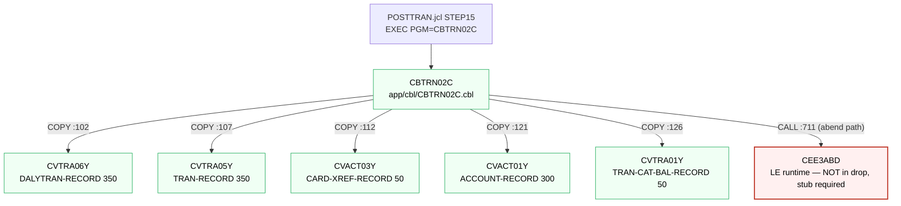
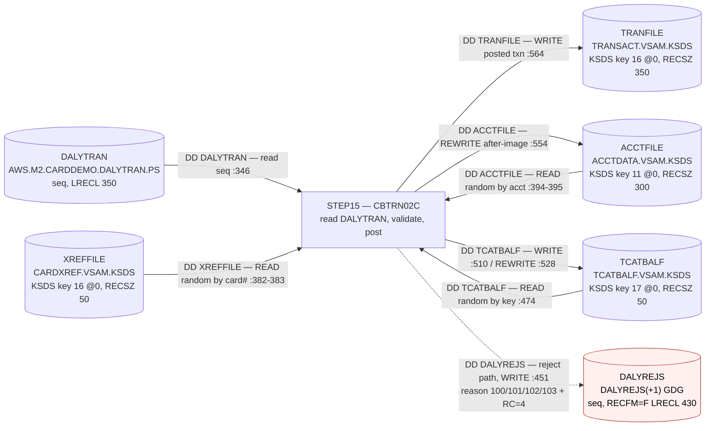

# Phase 1 — Inventory & Validation Scoping: POSTTRAN / CBTRN02C

Status: **Phase 1 only. No migrated code written, nothing committed beyond this document.**

Every claim below cites a file and line that was opened and read. Anything not opened is marked
"not analyzed".

---

## 1. Scope

### 1.1 What is in the drop

29 JCL members (`app/jcl/`), 2 PROCs (`app/proc/`), 1 control card member (`app/ctl/REPROCT.ctl`),
28 COBOL programs (`app/cbl/`), 28 copybooks (`app/cpy/`), 17 BMS map copybooks (`app/cpy-bms/`),
1 CICS CSD export (`app/csd/CARDDEMO.CSD`), 1 catalog listing (`app/catlg/LISTCAT.txt`),
12 EBCDIC data files (`app/data/EBCDIC/`) and 9 ASCII data files (`app/data/ASCII/`).

Of the 28 programs, 17 are CICS/BMS online programs (`CO*`) and 11 are batch/utility
(`CBACT01C`–`CBACT04C`, `CBCUS01C`, `CBTRN01C`–`CBTRN03C`, `CBSTM03A`, `CBSTM03B`, `CSUTLDTC`).

### 1.2 In-scope unit chosen

**`app/jcl/POSTTRAN.jcl`, step `STEP15`, program `CBTRN02C`** — daily transaction posting.

`app/jcl/POSTTRAN.jcl:23` — `//STEP15 EXEC PGM=CBTRN02C`.

Why this one:

- It is a **complete, self-contained job stream**: one step, one mainline program, no PROC
  expansion, no SORT/IDCAMS utility steps interleaved (`POSTTRAN.jcl:23-42` is the whole job).
- It exercises **real file I/O of every interesting kind**: sequential input, three keyed (VSAM
  KSDS) files read randomly, one keyed file written, two keyed files updated in place, and a
  sequential reject file (`CBTRN02C.cbl:29-61`).
- It has a **real reject/error path** with a distinct output dataset and a non-zero return code
  (`CBTRN02C.cbl:446-465`, `CBTRN02C.cbl:229-231`).
- The drop **already contains sample input** for it: `app/data/EBCDIC/AWS.M2.CARDDEMO.DALYTRAN.PS`
  (105 000 bytes = 300 × 350) plus ASCII equivalents for the three input VSAM files.

Alternatives rejected:

| Candidate | Why rejected |
|---|---|
| `TRANREPT.jcl` → `CBTRN03C` | Mainline step is preceded by a `PROC=REPROC` IDCAMS unload and a DFSORT step with SYMNAMES/INCLUDE control cards (`TRANREPT.jcl:23-55`). Parity would be dominated by reimplementing DFSORT, not business logic. Also needs `AWS.M2.CARDDEMO.DATEPARM` (`TRANREPT.jcl:73-74`), which is **not** in the drop. |
| `CREASTMT.JCL` → `CBSTM03A` | Most interesting call graph (only program in the drop with an application `CALL`, to `CBSTM03B`, `CBSTM03A.CBL:351`), but the job has 5 preceding IDCAMS/SORT/IEFBR14 steps (`CREASTMT.JCL:22-78`) and its input `AWS.M2.CARDDEMO.TRXFL.VSAM.KSDS` is a job-internal derivative not present in the drop. It also **does not compile** (see §5). Good *second* migration target. |
| `INTCALC.jcl` → `CBACT04C` | Single step and clean (`INTCALC.jcl:22`), but its `DISCGRP` and `XREFFIL1` (AIX PATH) inputs make it a good *second* target; POSTTRAN is upstream of it in the business flow, so POSTTRAN is the more defensible first slice. |
| `CBACT01C`/`CBACT02C`/`CBACT03C`/`CBCUS01C` | Leaf utilities — sequential read-and-print of one file each. Explicitly the kind of leaf utility the scope rules say to avoid. |
| Any `CO*` online program | CICS + BMS; needs a CICS emulator, not a COBOL emulator. Out of scope for a batch parity loop. |

### 1.3 Testing level this implies

This scope is **one step = one program**, so it is the *minimum testable block*: **program parity**.

What it proves: for a given set of input files and before-images, the migrated code produces
byte-identical (post-normalization) output files, after-images, reject records and return code.

What it does **not** prove:
- step-to-step handoffs (there is only one step — no GDG rolling, no `COND=`/`IF` step gating,
  no dataset passing between steps);
- the utility layer (IDCAMS `REPRO`/`DEFINE`, DFSORT) that other CardDemo jobs depend on;
- CICS online behaviour against the same files;
- job-level restart/rerun semantics.

---

## 2. Dependency graph

### 2.1 Program closure (breadth-first from `CBTRN02C`)

`CBTRN02C` contains exactly one `CALL` statement in non-comment code:

- `CBTRN02C.cbl:711` — `CALL 'CEE3ABD'.` inside `9999-ABEND-PROGRAM` (`CBTRN02C.cbl:707-711`).

`CEE3ABD` is the IBM Language Environment callable service for a user abend. It is **not an
application member** and is not expected in the drop; it needs a **local stub** for emulator runs.

There are **no other CALLs**, no `EXEC CICS`, no `EXEC SQL` in `CBTRN02C`. The program closure is
therefore a single node.

### 2.2 Copybook closure

`CBTRN02C.cbl:102,107,112,121,126` — `COPY CVTRA06Y / CVTRA05Y / CVACT03Y / CVACT01Y / CVTRA01Y`.
None of the five contains a nested `COPY` or `EXEC SQL INCLUDE` (checked directly).

### 2.3 Closure table

| Member | Type | Referenced by | Present? | Path |
|---|---|---|---|---|
| `CBTRN02C` | COBOL (batch mainline) | `POSTTRAN.jcl:23` | yes | `app/cbl/CBTRN02C.cbl` |
| `CVTRA06Y` | copybook — `DALYTRAN-RECORD` (350) | `CBTRN02C.cbl:102` | yes | `app/cpy/CVTRA06Y.cpy` |
| `CVTRA05Y` | copybook — `TRAN-RECORD` (350) | `CBTRN02C.cbl:107` | yes | `app/cpy/CVTRA05Y.cpy` |
| `CVACT03Y` | copybook — `CARD-XREF-RECORD` (50) | `CBTRN02C.cbl:112` | yes | `app/cpy/CVACT03Y.cpy` |
| `CVACT01Y` | copybook — `ACCOUNT-RECORD` (300) | `CBTRN02C.cbl:121` | yes | `app/cpy/CVACT01Y.cpy` |
| `CVTRA01Y` | copybook — `TRAN-CAT-BAL-RECORD` (50) | `CBTRN02C.cbl:126` | yes | `app/cpy/CVTRA01Y.cpy` |
| `CEE3ABD` | LE runtime service (not application code) | `CBTRN02C.cbl:711` | n/a — runtime-provided | — |

**Gaps in the closure: none.** Every application member referenced by the in-scope program exists
in the drop. The only unresolved symbol is the LE service, which is runtime-provided by design.

### 2.4 Program flow



### 2.5 Business / data flow



Reject reasons, all set in `CBTRN02C`:

| Code | Text | Line | Condition |
|---|---|---|---|
| 100 | `INVALID CARD NUMBER FOUND` | `:385-387` | `READ XREF-FILE` INVALID KEY on `DALYTRAN-CARD-NUM` |
| 101 | `ACCOUNT RECORD NOT FOUND` | `:397-399` | `READ ACCOUNT-FILE` INVALID KEY on `XREF-ACCT-ID` |
| 102 | `OVERLIMIT TRANSACTION` | `:410-412` | `ACCT-CREDIT-LIMIT < (CURR-CYC-CREDIT − CURR-CYC-DEBIT + DALYTRAN-AMT)` (`:403-407`) |
| 103 | `TRANSACTION RECEIVED AFTER ACCT EXPIRATION` | `:417-419` | `ACCT-EXPIRAION-DATE < DALYTRAN-ORIG-TS(1:10)` (`:414`) |
| 109 | `ACCOUNT RECORD NOT FOUND` | `:556-558` | `REWRITE` INVALID KEY on account after-image. **Dead-end path**: it is set *after* the reject decision was already made (`:211-216`), so it is recorded in no file and only affects nothing observable. Flagged as a latent bug in the legacy code, not a behaviour to reproduce silently. |

Note also `:229-231`: `IF WS-REJECT-COUNT > 0 MOVE 4 TO RETURN-CODE` — the step return code is part
of the observable contract.

---

## 3. Second-pass verification — what the first pass got wrong

Corrections, stated as corrections:

1. **The first pass over-counted CALLs.** A raw `grep -rn "CALL" app/cbl app/cpy` returns 38 hits.
   Filtering column-7 `*` comment lines removes 8 of them (e.g. `COCRDLIC.cbl:398`,
   `COCRDLIC.cbl:536`, `COCRDLIC.cbl:564`, `CSUTLDTC.cbl:2`), and two more are data-name matches,
   not statements: `COACTVWC.cbl:214` and `COCRDSLC.cbl:201`, both `05 CA-CALL-CONTEXT.`. **Corrected
   count of real CALL statements in the drop: 28**, all with literal targets.

2. **The first pass wrongly reported BMS map copybooks as missing.** Compiling the `CO*` programs
   with `-I app/cpy` produced `error: COACTUP: No such file or directory` (and 16 similar), which
   reads as a missing member. That is **wrong**: those members exist in a second copybook library,
   `app/cpy-bms/` (17 members, `COACTUP.CPY` … `COUSR03.CPY`). The real missing members for the
   online programs are only the IBM-supplied `DFHAID` and `DFHBMSCA`. This does not affect the
   in-scope closure, but it would have produced a false "incomplete drop" finding at job level.

3. **No dynamic calls anywhere in the drop.** Every `CALL` target is a literal
   (`'CEE3ABD'`, `'CSUTLDTC'`, `'CBSTM03B'`). Grepping for `CALL <identifier>` returns only comment
   lines. So static analysis *can* close this graph — no `VALUE`-clause resolution was required and
   nothing had to be flagged as unresolvable.

4. **One CALL is hidden inside a copybook and is not a comment.** `app/cpy/CSUTLDPY.cpy:293` has
   `005100     CALL 'CSUTLDTC'`. The leading `005100` is the sequence-number area (cols 1-6), not a
   comment marker, so this is a live statement that a naive "starts with digits ⇒ skip" filter would
   drop. It is reached only from `COACTUPC.cbl` (the only program that copies `CSUTLDPY`), so it is
   outside the in-scope closure — but it means the copybook layer can inject calls, and copybooks
   must be scanned for CALLs, not just for COPYs.

5. **No assembler members in the drop.** Every source file is `.cbl/.CBL`, `.cpy/.CPY`, `.jcl/.JCL`,
   `.prc`, `.ctl`, `.csd` or data. There is nothing to classify as assembler. The only non-COBOL
   callable is `CEE3ABD` (LE runtime, `CBTRN02C.cbl:711`) — classified as *compiler/runtime-provided*,
   not as a missing application member.

6. **No DB2 in the drop.** No `EXEC SQL` of any kind in `app/cbl` or `app/cpy`, so there are no SQL
   INCLUDEs and no SQLCA question.

### Cross-validation against independent inventories in the drop

- **`app/csd/CARDDEMO.CSD`** (CICS region definition — 18 `DEFINE PROGRAM`, 8 `DEFINE FILE`):
  `CBTRN02C` is **absent**, as are all other `CB*` batch programs. Agreement — batch programs are
  correctly outside the online closure. One discrepancy in the other direction:
  `CARDDEMO.CSD:211` defines `PROGRAM(COCRDSEC)`, and **no `COCRDSEC` source exists in the drop**.
  Assessment: a **deliberate exclusion** (an online security/menu program not shipped), not an
  overlooked transitive callee — no program in `app/cbl` references it, and the batch closure does
  not touch it.
- **`app/catlg/LISTCAT.txt`** (catalog listing): confirms every dataset the in-scope step names.
  `AWS.M2.CARDDEMO.DALYTRAN.PS` (`:786`), `.DALYTRAN.PS.INIT` (`:801`),
  `.ACCTDATA.VSAM.KSDS` cluster+data+index (`:22,47,80`),
  `.CARDXREF.VSAM.KSDS` cluster+data+index plus AIX and AIX PATH (`:365,393,424,455,351`),
  and `DALYREJS` as a **GDG base with 5 generations G0022V00–G0026V00** (`:684-696`).
  Exact agreement with the DD names read from `POSTTRAN.jcl`.

---

## 4. JCL / data layer (dedicated pass — the call graph does not see this)

### 4.1 Control cards

**`POSTTRAN.jcl` has no SYSIN and no instream control cards at all.** The whole job is
`POSTTRAN.jcl:23-42`: an `EXEC` and eight DD statements. There is nothing for a step to consume.

(For contrast, and *not* in scope: `TRANREPT.jcl:40-49` has SYMNAMES + SORT/INCLUDE control cards
consumed by the DFSORT step, and `app/ctl/REPROCT.ctl` holds `REPRO INFILE(FILEIN) OUTFILE(FILEOUT)`
consumed by `app/proc/REPROC.prc:21` via `//SYSIN DD DSN=&CNTLLIB(REPROCT)`.)

### 4.2 DD wiring vs. SELECT clauses

| DD (`POSTTRAN.jcl`) | SELECT / ASSIGN (`CBTRN02C.cbl`) | Open mode | Verdict |
|---|---|---|---|
| `DALYTRAN` :30 | `SELECT DALYTRAN-FILE ASSIGN TO DALYTRAN` :29 | `OPEN INPUT` :238 | matched |
| `TRANFILE` :28 | `SELECT TRANSACT-FILE ASSIGN TO TRANFILE` :34 | `OPEN OUTPUT` :256 | matched |
| `XREFFILE` :32 | `SELECT XREF-FILE ASSIGN TO XREFFILE` :40 | `OPEN INPUT` :275 | matched |
| `DALYREJS` :34 | `SELECT DALYREJS-FILE ASSIGN TO DALYREJS` :46 | `OPEN OUTPUT` :293 | matched |
| `ACCTFILE` :39 | `SELECT ACCOUNT-FILE ASSIGN TO ACCTFILE` :51 | `OPEN I-O` :311 | matched |
| `TCATBALF` :41 | `SELECT TCATBAL-FILE ASSIGN TO TCATBALF` :57 | `OPEN I-O` :329 | matched |
| `STEPLIB` :24 | — | — | system DD (load library), no SELECT expected |
| `SYSPRINT` :26 | — | — | system/LE DD, no SELECT expected |
| `SYSOUT` :27 | — | — | LE runtime output; the program's 45 `DISPLAY` statements land here (e.g. `:194`, `:227-232`, `:476-477`) |

**No DD without a SELECT (other than the three system DDs), and no SELECT without a DD.** The wiring
is complete and symmetric.

### 4.3 Dataset lineage

| DD | Dataset | Origin |
|---|---|---|
| `DALYTRAN` | `AWS.M2.CARDDEMO.DALYTRAN.PS` | **External to the job.** No JCL in the drop writes it (only `TRANFILE.jcl:54` reads the *different* `.PS.INIT` member). It arrives from outside CardDemo. Sample present: `app/data/EBCDIC/AWS.M2.CARDDEMO.DALYTRAN.PS`. |
| `XREFFILE` | `...CARDXREF.VSAM.KSDS` | Produced by **`XREFFILE.jcl`** — DELETE/DEFINE KSDS `KEYS(16 0) RECORDSIZE(50 50)` (`:181-194`), REPRO-loaded from `AWS.M2.CARDDEMO.CARDXREF.PS` (`:201-206`), then AIX `KEYS(11,25)` + PATH + BLDINDEX (`:214-244`). |
| `ACCTFILE` | `...ACCTDATA.VSAM.KSDS` | Produced by **`ACCTFILE.jcl`** — DEFINE `KEYS(11 0) RECORDSIZE(300 300)` (`:129-142`), REPRO-loaded from `AWS.M2.CARDDEMO.ACCTDATA.PS` (`:149-154`). |
| `TCATBALF` | `...TCATBALF.VSAM.KSDS` | Produced by **`TCATBALF.jcl`** — DEFINE `KEYS(17 0) RECORDSIZE(50 50)` (`:268-281`), REPRO-loaded from `AWS.M2.CARDDEMO.TCATBALF.PS` (`:286-293`). |
| `TRANFILE` | `...TRANSACT.VSAM.KSDS` | Cluster created by **`TRANFILE.jcl`** — DEFINE `KEYS(16 0) RECORDSIZE(350 350)` (`:33-46`), seeded by REPRO from the single-record `AWS.M2.CARDDEMO.DALYTRAN.PS.INIT` (`:53-58`), plus AIX `KEYS(26 304)` (`:66-75`). POSTTRAN then **opens it OUTPUT** (`CBTRN02C.cbl:256`). |
| `DALYREJS` | `AWS.M2.CARDDEMO.DALYREJS(+1)` | **GDG, new generation each run.** Base defined by `DALYREJS.jcl:24-28` (`LIMIT(5) SCRATCH`); `LISTCAT.txt:684-696` confirms 5 live generations. |

Two things worth surfacing before migration:

- **`TRANFILE` is `DISP=SHR` on an existing KSDS but opened `OUTPUT`** (`POSTTRAN.jcl:28-29` vs.
  `CBTRN02C.cbl:256`), and `TRANFILE.jcl:33-46` defines the cluster **without `REUSE`**. Read
  literally, each POSTTRAN run *replaces* the transaction master with only the transactions posted
  that day rather than appending to it. On z/OS, `OPEN OUTPUT` against a loaded non-`REUSE` cluster
  is normally rejected. I have not observed a baseline run, so I am flagging this as a **question
  for the source-system team**, not a claim: does POSTTRAN reload TRANSACT from empty every run, and
  if the open fails, how is the master actually maintained? (`COMBTRAN.jcl:41-48` REPRO-loading
  TRANSACT from a merged file suggests the master is rebuilt elsewhere in the cycle.)
- **The GDG `(+1)` means POSTTRAN is not idempotent for reruns**: a rerun consumes another
  generation and, with `LIMIT(5)`, rolls the oldest off. The parity harness must pin the generation
  explicitly rather than resolve `(+1)`.

### 4.4 PARM

**`POSTTRAN.jcl:23` passes no PARM**, and `CBTRN02C.cbl:193` is a bare `PROCEDURE DIVISION.` with no
`USING` — so there is no parameter to validate or branch on. The program's only external date input
is `FUNCTION CURRENT-DATE` (`CBTRN02C.cbl:693`), used to stamp `TRAN-PROC-TS` (`:437-438`).
**That is a non-determinism source and must be injectable in the migrated code** or every parity
diff will fail on the timestamp column.

(By contrast `INTCALC.jcl:22` does pass `PARM='2022071800'` to `CBACT04C` — out of scope.)

### 4.5 Per-DD file organization, record format and layout

| DD | Organization | LRECL / RECFM | Key | Copybook defining the record |
|---|---|---|---|---|
| `DALYTRAN` | sequential (`CBTRN02C.cbl:30`) | 350 (FD `:67-69`) | — | `CVTRA06Y` — `DALYTRAN-RECORD` |
| `TRANFILE` | indexed, random (`:35-37`) | 350, `RECORDSIZE(350 350)` (`TRANFILE.jcl:38`) | `FD-TRANS-ID` X(16) @0 | `CVTRA05Y` — `TRAN-RECORD` |
| `XREFFILE` | indexed, random (`:41-43`) | 50, `RECORDSIZE(50 50)` (`XREFFILE.jcl:186`) | `FD-XREF-CARD-NUM` X(16) @0 | `CVACT03Y` — `CARD-XREF-RECORD` |
| `ACCTFILE` | indexed, random (`:52-54`) | 300, `RECORDSIZE(300 300)` (`ACCTFILE.jcl:134`) | `FD-ACCT-ID` 9(11) @0 | `CVACT01Y` — `ACCOUNT-RECORD` |
| `TCATBALF` | indexed, random (`:58-60`) | 50, `RECORDSIZE(50 50)` (`TCATBALF.jcl:273`) | `FD-TRAN-CAT-KEY` 17 bytes (acct 9(11) + type X(2) + cat 9(4)) `:93-96` | `CVTRA01Y` — `TRAN-CAT-BAL-RECORD` |
| `DALYREJS` | sequential (`:47`) | `RECFM=F,LRECL=430` (`POSTTRAN.jcl:36`) | — | FD `:82-84` = 350-byte copy of the input record + 80-byte trailer (`WS-VALIDATION-TRAILER`, `:180-182`) |

All FD record lengths reconcile with both the copybooks and the IDCAMS `RECORDSIZE` values; no
layout mismatch was found. Note the amount fields are **signed zoned decimal** —
`DALYTRAN-AMT PIC S9(09)V99` (`CVTRA06Y.cpy`), `ACCT-CURR-BAL`/`ACCT-CREDIT-LIMIT`/
`ACCT-CURR-CYC-CREDIT`/`ACCT-CURR-CYC-DEBIT` all `PIC S9(10)V99` (`CVACT01Y.cpy:7-14`),
`TRAN-CAT-BAL PIC S9(09)V99` (`CVTRA01Y.cpy`) — i.e. **sign overpunch in the last byte**, which is
the single most likely thing to be destroyed by a careless ASCII translation at extraction time.

---

## 5. Emulator compile — attempted, results

Compiler used: **GnuCOBOL 3.1.2.0**, indexed file handler **BDB** (`cobc --info`).

### In-scope closure

```
cobc -x -I app/cpy -o CBTRN02C app/cbl/CBTRN02C.cbl
```

**Clean compile, zero errors, zero warnings.** This is the mechanical proof that the copybook
closure for the in-scope program is complete.

### Whole-drop compile (for context)

| Group | Result |
|---|---|
| `CBACT01C`, `CBACT02C`, `CBACT03C`, `CBACT04C`, `CBCUS01C`, `CBTRN01C`, `CBTRN02C`, `CBTRN03C`, `CBSTM03B`, `CSUTLDTC` | **compile clean** (10 of 10) |
| `CBSTM03A` | **fails** — not because of a missing member, but because `app/cpy/CUSTREC.cpy` uses **hard tab characters in the indentation** of lines 6 onward, which shifts the source out of the fixed-format area: `CUSTREC.cpy:6: error: unbalanced parentheses` / `invalid PICTURE character '2'`. A real, fixable source-hygiene defect in the drop. |
| 17 `CO*` CICS programs | fail on `DFHAID` / `DFHBMSCA` (IBM-supplied CICS copybooks, correctly absent) once `-I app/cpy-bms` is added for the map copybooks. Expected — they need a CICS translator, not just a COBOL compiler. |

### Beyond compile: the legacy step actually **runs** locally

I loaded the drop's own ASCII sample data into BDB indexed files (50 xref, 50 account, 50 tcatbal
records) and ran the compiled `CBTRN02C` against the 300-record `dailytran` sample with the six DDs
wired to local files:

```
TRANSACTIONS PROCESSED :000000300
TRANSACTIONS REJECTED  :000000038
step return code = 4
```

> **Corrected during Phase 2.** This run first reported **43** rejects. That figure was wrong and
> the cause is worth recording: the program had been compiled without `-fsign=EBCDIC`, so GnuCOBOL
> did not recognise the `}J..R` sign overpunch and read every negative amount as positive, pushing
> five transactions over the credit limit that do not belong there. Recompiled as
> `cobc -x -fsign=EBCDIC`, the same inputs give **38**. The numbers below are the corrected run.

- 50 `TCATBAL record not found ... Creating.` messages (`CBTRN02C.cbl:476-478`) — the create branch
  at `:503-524` is exercised.
- `DALYREJS` output = 16 340 bytes = **38 × 430**, confirming the reject record layout.
- **All 38 rejects carry reason `0102 OVERLIMIT TRANSACTION`.** Reasons **100, 101 and 103 are never
  triggered** by the shipped sample — see §6, branch coverage.
- `RETURN-CODE 4` observed, matching `:229-231`.

So the reference side of the parity loop is already runnable today on the drop's own data. What is
missing is a *mainframe baseline* to compare it against (§6).

---

## 6. What the validation loop needs

### 6.1 Needed from the source-system team

1. **Sample input** — `AWS.M2.CARDDEMO.DALYTRAN.PS` as a **raw, untranslated EBCDIC dump**, from the
   same run as everything below.
2. **Before-images of every keyed file the step reads or updates**, taken immediately before the
   baseline run: `ACCTDATA.VSAM.KSDS`, `CARDXREF.VSAM.KSDS`, `TCATBALF.VSAM.KSDS`, and the
   pre-run state of `TRANSACT.VSAM.KSDS` (IDCAMS `REPRO` unloads, binary, not printed).
3. **Known-good outputs from that same run**: the resulting `TRANSACT.VSAM.KSDS`, the
   `AWS.M2.CARDDEMO.DALYREJS.Gnnnnv00` generation actually created, and the **after-images** of
   `ACCTDATA` and `TCATBALF`.
4. **The job log for that run** — SYSOUT (the program's `DISPLAY`s including the two counters), the
   **step return code**, and the resolved `DALYREJS` generation number.
5. **The run's wall-clock date/time**, because `TRAN-PROC-TS` is stamped from `FUNCTION CURRENT-DATE`
   (`:693`) and cannot otherwise be reproduced.
6. **Confirmation on the `OPEN OUTPUT` / `DISP=SHR` question in §4.3** — is TRANSACT emptied by this
   step or not?
7. **Delivery channel**: a git repo (or S3 bucket) — email attachments of raw EBCDIC will be either
   DLP-blocked or silently code-page-translated, which destroys the packed/zoned sign bytes.

### 6.2 Needed on the migration side

| Item | Status |
|---|---|
| Emulator compile of the full in-scope tree | **done** — clean (§5) |
| Stub for `CEE3ABD` | **needed** — trivial (abend-and-exit shim); GnuCOBOL resolves the CALL at runtime, so the abend path is currently untested |
| Stubs for DB2/CICS | **not needed** — none in the in-scope closure |
| Format converters (EBCDIC ⇄ ASCII, zoned-decimal sign overpunch, fixed-width) per copybook layout | **needed** — 5 layouts (350/350/50/300/50) |
| VSAM KSDS ⇄ local indexed loader/unloader | **prototyped** — I generated key-aware loaders and loaded all three KSDS inputs successfully |
| Normalization + value-level diff harness | **needed** — must special-case `TRAN-PROC-TS` (`:438`) and the GDG generation number |
| Step harness reproducing DD wiring + PARM passthrough | **prototyped** — six DD environment variables; no PARM to pass |

### 6.3 What the drop already contains vs. what is missing

**Present:** the input transaction file (both EBCDIC and ASCII, 300 records), and before-image-ish
seed data for all three input VSAM files (ASCII `acctdata.txt`, `cardxref.txt`, `tcatbal.txt` and
their EBCDIC `.PS` equivalents), plus the IDCAMS definitions to rebuild the clusters.

**Missing — and this is what blocks a true parity loop:**
- No **known-good outputs** of any kind. There is no `TRANSACT` after-image, no `DALYREJS`
  generation content, no post-run `ACCTDATA`/`TCATBALF`.
- No **job log / SYSOUT** and no recorded return code.
- No **run timestamp**, so `TRAN-PROC-TS` cannot be reproduced even in principle.
- The seed data is *initial* state, not a captured **before-image paired to a specific baseline
  run** — nothing in the drop ties an input state to an output state.

One extraction hazard already visible in the drop: `app/data/ASCII/cardxref.txt` records are **36
characters, not 50** — the trailing `FILLER PIC X(14)` (`CVACT03Y.cpy`) has been stripped by the
ASCII conversion. The EBCDIC file is the correct 2 500 bytes (50 × 50). A converter that trusts the
ASCII files will build short records. This is exactly the class of damage the intake checklist
exists to catch.

### 6.4 Intake checklist, ordered by cost-of-failure

1. **Encoding integrity.** Confirm the files are raw untranslated dumps: file size must be an exact
   multiple of the LRECL (350/300/50/50/430); decode sample records against the copybooks and check
   that the last byte of every `S9(n)V99` field is a valid EBCDIC sign overpunch (`C0`–`C9`/`D0`–`D9`
   in the zoned representation) and that dates/timestamps land in the right columns. **ASCII
   translation is irreversible for these fields** — catching this at intake saves a full
   re-extraction.
2. **Completeness of the parity set.** Inputs + before-images + *all* outputs (TRANSACT, DALYREJS
   generation, after-images of ACCTDATA and TCATBALF) + SYSOUT + return code, **all from one run**.
   Reject partial sets immediately.
3. **Run parameters.** No PARM exists for this step, but the **run timestamp** and the **resolved
   `DALYREJS` generation number** are required; if several runs are delivered, each file must be
   unambiguously labelled with its run.
4. **Baseline mode consistency.** The `CEE3ABD` abend path and the `TRANFILE` open mode must be
   handled identically in baseline and migrated runs; if the mainframe baseline was run with TRANSACT
   pre-emptied, the migrated run must do the same.
5. **Branch coverage.** The shipped sample fires **only** reason 102 (38 of 300). A baseline extract
   that behaves the same validates almost nothing about this edit program. Ask explicitly for a
   sample that also fires **100** (card number not in XREF), **101** (XREF hit but account missing)
   and **103** (transaction dated after `ACCT-EXPIRAION-DATE`), plus at least one negative
   `DALYTRAN-AMT` to exercise the `ACCT-CURR-CYC-DEBIT` branch (`:548-552`) and one TCATBAL
   *update* (not create) path (`:526-542`).
6. **Internal consistency.** `DALYREJS` size ÷ 430 must equal the `TRANSACTIONS REJECTED` counter in
   SYSOUT; `TRANSACT` record count must equal processed − rejected; spot-check one account end-to-end
   (before-image balance + summed posted amounts = after-image balance, per `:547-552`).

---

## 7. Verdict

**No — the drop is not complete enough to run a true parity loop today.**

It is complete enough to run the *reference side*: the in-scope program compiles clean and executes
end-to-end on the drop's own sample data (§5). What is missing is the mainframe **baseline**:
known-good outputs, after-images, SYSOUT/return code, and the run timestamp — items 1–5 of §6.1.
Without them there is nothing to diff against, and the timestamp non-determinism means even a
perfect reimplementation cannot be shown to match.

What Phase 2 *is* supported for, without any new data:
- reimplementing `CBTRN02C` against cited COBOL and proving it with **functional tests** derived from
  the cited lines;
- **self-consistency parity**: legacy GnuCOBOL run vs. migrated run on the drop's own sample inputs,
  diffed under normalization. This is real evidence and catches most translation errors.

What cannot be validated until data arrives:
- behaviour on reject reasons **100, 101, 103** (never fired by the shipped sample);
- the TCATBAL **update** branch and the negative-amount **debit** branch, unless I hand-craft inputs
  (which proves the reimplementation, not the mainframe's behaviour);
- the `CEE3ABD` **abend** path;
- the real `TRANFILE` open/replace semantics (§4.3).

---

## 8. Phase 2 plan (to be approved alongside the map)

Target stack: **Java 21 + Spring Batch**, chosen because the repo contains no modern stack to inherit
(it is pure COBOL/JCL/BMS), because the JCL step→program→DD model maps directly onto Spring Batch
job→step→`ItemReader`/`ItemWriter` with named resources, and because fixed-width record mapping and
BigDecimal fixed-point arithmetic — the two things this program is made of — are well served there.
I will not modify any legacy source; it stays the reference. I will build: fixed-width record
mappers generated from the five copybooks (with EBCDIC/zoned-sign handling), keyed stores for the
four VSAM files, a `CBTRN02C` equivalent implementing validation reasons 100/101/102/103, the
TCATBAL create/update branches, the account balance/cycle updates and the RC=4 rule — **every
behaviour traced to a cited line** — plus an injectable clock for `TRAN-PROC-TS`. Proof: for each
behaviour I will state which of the two evidence types it rests on — **self-consistency parity**
(legacy GnuCOBOL vs. migrated, same inputs, normalized diff of TRANSACT/DALYREJS/after-images) where
the sample exercises it, and **functional tests derived from cited COBOL** where it does not — and
the PR will carry this report, both diagrams and the diff output.

---

## 9. Phase 2 outcome (executed after sign-off)

The plan above was carried out; the implementation, harness and evidence live in
[`migration/posttran/`](../migration/posttran/README.md), and the legacy source was not modified.

**The migrated step reproduces the legacy program byte for byte on both input sets** — posted
transactions, account after-images, category balances, the reject file, SYSOUT and the return code.
The only normalised field is `TRAN-PROC-TS` (`:438`), which is asserted for format instead and is
injectable so a run can be pinned. `harness/parity.sh` regenerates the comparison from the COBOL;
`cd java && mvn test` replays it against the recorded baselines without needing a COBOL compiler.

| input set | posted | rejects | reject reasons reached | return code |
|---|---|---|---|---|
| shipped sample, 300 records | 262 | 38 | 102 only | 4 |
| generated mock set, 11 records | 6 | 5 | 100, 101, 102, 103 | 4 |

The branch-coverage gap in §6 is closed for the branches the drop could not reach:
`harness/gen_mock_data.py` derives inputs from the drop's own accounts, cards and category balances
that fire reasons 100, 101 and 103, the TCATBAL create branch, the negative-amount debit branch and
both `>=` boundaries — and the legacy program's behaviour on each was recorded and matched, not
assumed. One ordering detail only that data exposes: a transaction that is both overlimit and
expired is reported as **103**, because the expiration check at `:414-419` runs after the limit
check and assigns unconditionally, overwriting the 102.

**Unchanged by Phase 2:** everything in §6.1 still stands. This is self-consistency parity against
GnuCOBOL, not against z/OS — a mainframe baseline is still needed to prove the reference itself is
faithful. The `CEE3ABD` abend path and the `TRANFILE` `OPEN OUTPUT` / `DISP=SHR` question (§4.3)
remain unvalidated, and parity here covers one step, not the job stream.
