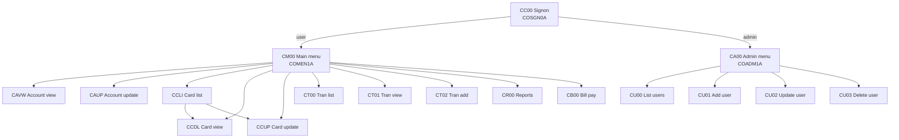

# BMS Screen Map Documentation

This documents all **17 BMS source members** in [`app/bms/`](../app/bms/). Each `.bms` defines one
**mapset** (`DFHMSD`) containing one **map** (`DFHMDI`) made of `DFHMDF` fields. The mapset
generates the symbolic copybook of the same name in [`app/cpy-bms/`](../app/cpy-bms/) (field widths
are tabulated in [data-dictionary.md § D](data-dictionary.md#d-bms-symbolic-map-copybooks-appcpy-bms-17-files)).

Standard attributes: `DFHMSD MODE=INOUT, TYPE=&SYSPARM, LANG=COBOL, STORAGE=AUTO, TIOAPFX=YES`;
most maps are 24×80 with `CTRL=(FREEKB)` (unlock keyboard) and many add `ALARM`. Every screen shares
a common header band: transaction name, two title lines, program name, current date and current time.

---

## Map ↔ transaction ↔ program

| BMS file     | Mapset  | Map      | Trans | Program  | Screen function |
|:-------------|:--------|:---------|:------|:---------|:----------------|
| COSGN00.bms  | COSGN00 | COSGN0A  | CC00  | COSGN00C | Signon |
| COMEN01.bms  | COMEN01 | COMEN1A  | CM00  | COMEN01C | Main menu (user) |
| COADM01.bms  | COADM01 | COADM1A  | CA00  | COADM01C | Admin menu |
| COACTVW.bms  | COACTVW | CACTVWA  | CAVW  | COACTVWC | Account view |
| COACTUP.bms  | COACTUP | CACTUPA  | CAUP  | COACTUPC | Account update |
| COCRDLI.bms  | COCRDLI | CCRDLIA  | CCLI  | COCRDLIC | Credit card list |
| COCRDSL.bms  | COCRDSL | CCRDSLA  | CCDL  | COCRDSLC | Credit card view |
| COCRDUP.bms  | COCRDUP | CCRDUPA  | CCUP  | COCRDUPC | Credit card update |
| COTRN00.bms  | COTRN00 | COTRN0A  | CT00  | COTRN00C | Transaction list |
| COTRN01.bms  | COTRN01 | COTRN1A  | CT01  | COTRN01C | Transaction view |
| COTRN02.bms  | COTRN02 | COTRN2A  | CT02  | COTRN02C | Transaction add |
| CORPT00.bms  | CORPT00 | CORPT0A  | CR00  | CORPT00C | Transaction reports |
| COBIL00.bms  | COBIL00 | COBIL0A  | CB00  | COBIL00C | Bill payment |
| COUSR00.bms  | COUSR00 | COUSR0A  | CU00  | COUSR00C | List users |
| COUSR01.bms  | COUSR01 | COUSR1A  | CU01  | COUSR01C | Add user |
| COUSR02.bms  | COUSR02 | COUSR2A  | CU02  | COUSR02C | Update user |
| COUSR03.bms  | COUSR03 | COUSR3A  | CU03  | COUSR03C | Delete user |

---

## Screen details

In the field summaries below, the common header band (TRNNAME, TITLE01, TITLE02, PGMNAME, CURDATE,
CURTIME) is present on every screen and is not repeated.

### COSGN0A — Signon (CC00 / COSGN00C)
- **Input:** USERID `X(8)`, PASSWD `X(8)` (dark/non-display).
- **Display:** APPLID `X(8)`, SYSID `X(8)`, ERRMSG `X(78)`.
- **Function:** Validate userid/password against USRSEC; route to user or admin menu.

### COMEN1A — Main menu (CM00 / COMEN01C)
- **Display:** OPTN001–OPTN012 `X(40)` (menu option labels from `COMEN02Y`).
- **Input:** OPTION `X(2)` (selected option), ERRMSG `X(78)`.

### COADM1A — Admin menu (CA00 / COADM01C)
- **Display:** OPTN001–OPTN012 `X(40)` (admin options from `COADM02Y`).
- **Input:** OPTION `X(2)`, ERRMSG `X(78)`.

### CACTVWA — Account view (CAVW / COACTVWC)
- **Input:** account id (entered to retrieve).
- **Display (read-only):** ACSTTUS, ADTOPEN, ACRDLIM, AEXPDT, ACSHLIM, AREISDT, ACURBAL, ACRCYCR,
  AADDGRP, ACRCYDB, plus full customer block (ACSTNUM, ACSTSSN, ACSTDOB, ACSTFCO, name fields,
  address, phones, ACSGOVT, ACSEFTC, ACSPFLG), INFOMSG, ERRMSG.

### CACTUPA — Account update (CAUP / COACTUPC)
- **Input/editable:** ACCTSID `X(11)`, ACSTTUS, OPN/EXP/RIS date parts (YEAR/MON/DAY), ACRDLIM,
  ACSHLIM, ACURBAL, ACRCYCR, ACRCYDB, AADDGRP, full customer block (SSN parts, DOB parts, names,
  address, phone parts, ACSTFCO, ACSGOVT, ACSEFTC, ACSPFLG).
- **Display:** INFOMSG `X(45)`, ERRMSG `X(78)`, function-key prompts (FKEYS/FKEY05/FKEY12).
- **Function:** edit + rewrite ACCTDAT and CUSTDAT.

### CCRDLIA — Credit card list (CCLI / COCRDLIC)
- **Input filter:** ACCTSID `X(11)`, CARDSID `X(16)`, PAGENO `X(3)`.
- **List rows (7):** CRDSELn `X(1)` (select), ACCTNOn `X(11)`, CRDNUMn `X(16)`, CRDSTSn `X(1)`.
- **Display:** INFOMSG, ERRMSG. Supports paging and row selection to view/update.

### CCRDSLA — Credit card view (CCDL / COCRDSLC)
- **Input:** ACCTSID `X(11)`, CARDSID `X(16)`.
- **Display:** CRDNAME `X(50)`, CRDSTCD `X(1)`, EXPMON `X(2)`, EXPYEAR `X(4)`, INFOMSG, ERRMSG, FKEYS.

### CCRDUPA — Credit card update (CCUP / COCRDUPC)
- **Input/editable:** ACCTSID, CARDSID, CRDNAME, CRDSTCD, EXPMON, EXPYEAR, EXPDAY.
- **Display:** INFOMSG, ERRMSG, FKEYS/FKEYSC. Rewrites CARDDAT.

### COTRN0A — Transaction list (CT00 / COTRN00C)
- **Input filter:** TRNIDIN `X(16)`, PAGENUM `X(8)`.
- **List rows (10):** SEL000n `X(1)`, TRNIDn `X(16)`, TDATEn `X(8)`, TDESCn `X(20)`, TAMTn `X(12)`.
- **Display:** ERRMSG.

### COTRN1A — Transaction view (CT01 / COTRN01C)
- **Input:** TRNIDIN `X(16)`.
- **Display:** TRNID, CARDNUM, TTYPCD, TCATCD, TRNSRC, TDESC `X(100)`, TRNAMT, TORIGDT/TPROCDT `X(26)`,
  merchant MID/MNAME/MCITY/MZIP, ERRMSG.

### COTRN2A — Transaction add (CT02 / COTRN02C)
- **Input/editable:** ACTIDIN `X(11)`, CARDNIN `X(16)`, TTYPCD, TCATCD, TRNSRC, TDESC, TRNAMT,
  TORIGDT, TPROCDT, merchant fields, CONFIRM `X(1)`.
- **Display:** ERRMSG. Date fields validated via CSUTLDTC; writes TRANSACT.

### CORPT0A — Transaction reports (CR00 / CORPT00C)
- **Input:** report type flags MONTHLY/YEARLY/CUSTOM `X(1)`, start date SDTMM/SDTDD/SDTYYYY,
  end date EDTMM/EDTDD/EDTYYYY, CONFIRM `X(1)`.
- **Display:** ERRMSG. Submits report JCL through the internal reader.

### COBIL0A — Bill payment (CB00 / COBIL00C)
- **Input:** ACTIDIN `X(11)`, CONFIRM `X(1)`.
- **Display:** CURBAL `X(14)`, ERRMSG. Pays full balance and writes a payment transaction.

### COUSR0A — List users (CU00 / COUSR00C)
- **Input filter:** USRIDIN `X(16)`, PAGENUM `X(8)`.
- **List rows (10):** SEL000n `X(1)`, USRIDn `X(8)`, FNAMEn `X(20)`, LNAMEn `X(20)`, UTYPEn `X(1)`.
- **Display:** ERRMSG.

### COUSR1A — Add user (CU01 / COUSR01C)
- **Input/editable:** FNAME `X(20)`, LNAME `X(20)`, USERID `X(8)`, PASSWD `X(8)`, USRTYPE `X(1)`.
- **Display:** ERRMSG. Writes USRSEC.

### COUSR2A — Update user (CU02 / COUSR02C)
- **Input/editable:** USRIDIN `X(8)`, FNAME, LNAME, PASSWD, USRTYPE.
- **Display:** ERRMSG. Reads + rewrites USRSEC.

### COUSR3A — Delete user (CU03 / COUSR03C)
- **Input:** USRIDIN `X(8)`.
- **Display:** FNAME, LNAME, USRTYPE (for confirmation), ERRMSG. Deletes from USRSEC.

---

## Screen navigation overview

</content>
