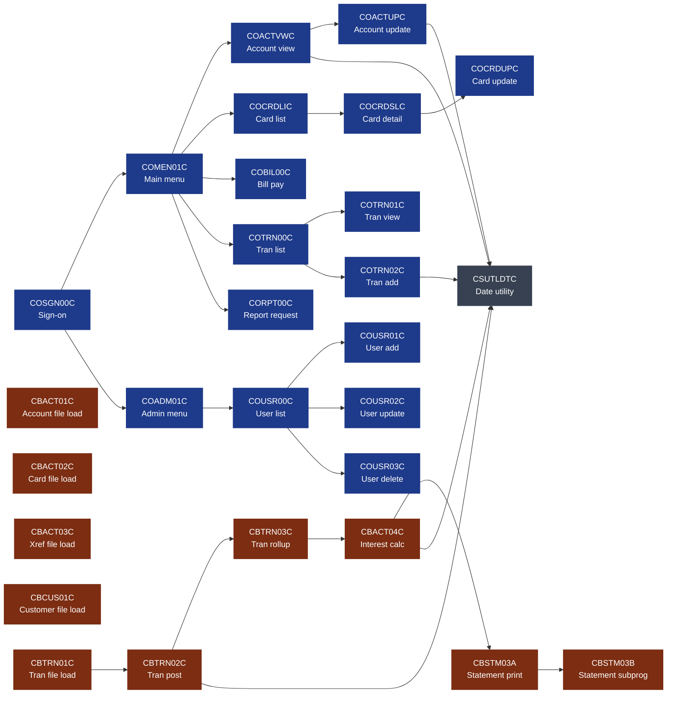
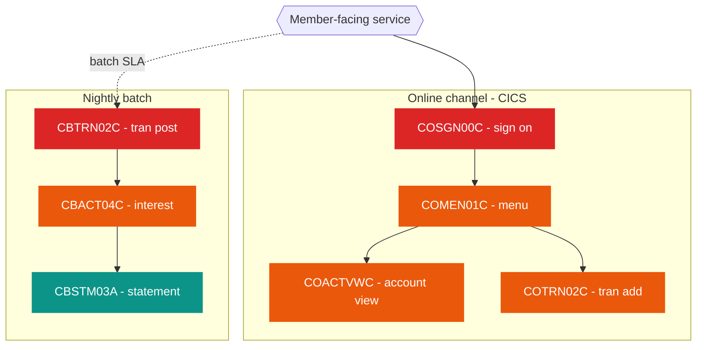

# Nationwide Legacy Card Processing — Dependency Graph

> Generated by Devin from a static analysis of 30 COBOL programs and 28 copybooks under `cobol-source/`. Run time: ~3 minutes. Refreshable any time the source is updated.

## How to read this

Three graphs follow:

1. **Program-to-program call graph** — which programs invoke which. Maps the runtime topology of the online (CICS) and batch estates.
2. **Program-to-data graph** — which programs read/write which VSAM datasets, sequential files, and BMS maps. Maps the data-flow topology.
3. **Critical paths** — the small set of programs whose failure constitutes a member-facing outage.

Mermaid diagrams render in GitHub, GitLab, modern IDEs, and Confluence. If your renderer doesn't support mermaid, the `dependency-graph.svg` next to this file is a static export.

---

## 1. Program-to-program call graph

**Reading the graph:**

- The **online** estate (blue) has a clear spine: `COSGN00C` is the only entry. Everything fans out from `COMEN01C` (member menu) or `COADM01C` (admin menu). Sign-on is the single most depended-upon online component.
- The **batch** estate (brown) has two pipelines: a file-load pipeline (CBACT* / CBCUS01C) that refreshes the masters, and a transaction pipeline (CBTRN01C → CBTRN02C → CBTRN03C → CBACT04C → CBSTM03A) that runs nightly to post transactions, accrue interest, and produce statements.
- `CBTRN02C` (daily transaction posting) is the **critical-path batch**. Every card transaction posted in a 24-hour window flows through it.
- `CSUTLDTC` (date validation) is a transversal utility called from both estates.

---

## 2. Program-to-data graph

```mermaid
graph LR
  classDef vsam fill:#0f766e,color:#fff,stroke:#0f766e
  classDef seq fill:#92400e,color:#fff,stroke:#92400e
  classDef bms fill:#6b21a8,color:#fff,stroke:#6b21a8
  classDef prog fill:#334155,color:#fff,stroke:#334155

  %% Masters (VSAM KSDS)
  ACCT[("ACCTDAT<br/>Account master<br/>VSAM KSDS")]:::vsam
  CUST[("CUSTDAT<br/>Customer master<br/>VSAM KSDS")]:::vsam
  CARD[("CARDDAT<br/>Card master<br/>VSAM KSDS")]:::vsam
  XREF[("CARDXREF<br/>Card xref<br/>VSAM KSDS")]:::vsam
  TRAN[("TRANSACT<br/>Transaction master<br/>VSAM KSDS")]:::vsam
  TCATBAL[("TCATBAL<br/>Tran-cat balance<br/>VSAM KSDS")]:::vsam
  USRSEC[("USRSEC<br/>User security<br/>VSAM KSDS")]:::vsam

  %% Sequential / batch files
  DALYTRAN[/"DALYTRAN.PS<br/>Daily tran feed"/]:::seq
  REJECT[/"DALYREJS.PS<br/>Reject file"/]:::seq
  STATMENT[/"STATMENT.PS<br/>Statement file"/]:::seq

  %% Online programs
  COSGN00C[COSGN00C]:::prog --> USRSEC
  COACTVWC[COACTVWC]:::prog --> ACCT
  COACTVWC --> CUST
  COACTVWC --> XREF
  COACTUPC[COACTUPC]:::prog --> ACCT
  COACTUPC --> CUST
  COCRDLIC[COCRDLIC]:::prog --> CARD
  COCRDLIC --> XREF
  COCRDSLC[COCRDSLC]:::prog --> CARD
  COCRDUPC[COCRDUPC]:::prog --> CARD
  COTRN00C[COTRN00C]:::prog --> TRAN
  COTRN01C[COTRN01C]:::prog --> TRAN
  COTRN02C[COTRN02C]:::prog --> TRAN
  COTRN02C --> ACCT
  COTRN02C --> XREF
  COBIL00C[COBIL00C]:::prog --> ACCT
  COBIL00C --> TRAN
  CORPT00C[CORPT00C]:::prog --> TRAN

  %% Batch programs
  CBACT01C[CBACT01C]:::prog --> ACCT
  CBACT02C[CBACT02C]:::prog --> CARD
  CBACT03C[CBACT03C]:::prog --> XREF
  CBCUS01C[CBCUS01C]:::prog --> CUST
  CBACT04C[CBACT04C]:::prog --> ACCT
  CBACT04C --> TCATBAL
  CBTRN01C[CBTRN01C]:::prog --> DALYTRAN
  CBTRN02C[CBTRN02C]:::prog --> DALYTRAN
  CBTRN02C --> TRAN
  CBTRN02C --> ACCT
  CBTRN02C --> CARD
  CBTRN02C --> XREF
  CBTRN02C --> TCATBAL
  CBTRN02C --> REJECT
  CBTRN03C[CBTRN03C]:::prog --> TRAN
  CBTRN03C --> TCATBAL
  CBSTM03A[CBSTM03A]:::prog --> ACCT
  CBSTM03A --> CUST
  CBSTM03A --> TRAN
  CBSTM03A --> STATMENT

  %% BMS maps (representative)
  COMEN01M[/"COMEN01.bms"/]:::bms
  COSGN00M[/"COSGN00.bms"/]:::bms
  COACTVWM[/"COACTVW.bms"/]:::bms
  COSGN00C --> COSGN00M
  COACTVWC --> COACTVWM
```

**The data hubs:**

| Dataset | Read by | Written by | Single-point-of-failure? |
|---|---|---|---|
| `ACCTDAT` (Account master) | COACTVWC, COBIL00C, CBACT04C, CBSTM03A | COACTUPC, CBACT01C, CBTRN02C | Yes — outage = no card transactions can be posted |
| `CARDXREF` (Card xref) | COACTVWC, COCRDLIC, COTRN02C | CBACT03C, CBTRN02C | Yes — most-depended-upon dataset, indirectly behind every card lookup |
| `CARDDAT` (Card master) | COCRDLIC, COCRDSLC, CBTRN02C | COCRDUPC, CBACT02C | Yes |
| `TRANSACT` (Transaction master) | COTRN00C, COTRN01C, CORPT00C, CBTRN03C, CBSTM03A | COBIL00C, COTRN02C, CBTRN02C | Partial — appendable, latest record loss tolerable |
| `TCATBAL` (Tran-category balance) | CBACT04C | CBTRN02C, CBTRN03C | No — derivable from TRANSACT |
| `CUSTDAT` (Customer master) | COACTVWC, COACTUPC, CBSTM03A | CBCUS01C | Yes — member data master |
| `USRSEC` (User security) | COSGN00C | (admin via COUSR0*C) | Yes — sign-on fails without it |

---

## 3. Critical paths (member-facing outage if these fail)

**Devin's classification:**

- **Hot (red)** — `COSGN00C` and `CBTRN02C`. Failure is a member-facing outage in <15 minutes. These are the IBS-critical components from Scene 4.
- **Warm (orange)** — `COMEN01C`, `COACTVWC`, `COTRN02C`, `CBACT04C`. Failure degrades service but does not stop the bank. Member impact in 1–4 hours.
- **Cool (teal)** — `CBSTM03A`. Failure is a paper-statement delay, communicable to members, regulatorily tolerable for ~24 hours.

---

## Next outputs

- [`modernization-backlog.md`](./modernization-backlog.md) — what to migrate, in what order.
- [`complexity-report.md`](./complexity-report.md) — where the land mines are.

Both are derived from the same source analysis as this graph.
