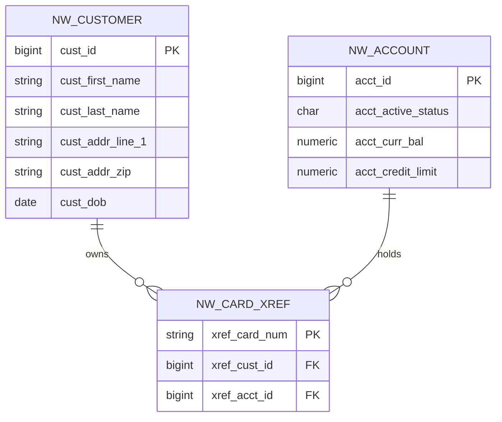

# Nationwide Source Model

This folder documents the Nationwide-side source model that the unified API consumes via the anti-corruption layer. It does **not** contain a separate Maven project — the entity classes are co-located in the unified-api project under the `uk.co.nationwide.unified.nationwide` package, so the demo builds in one go.

## Source-of-truth for the model

The Nationwide source model is the CardDemo VSAM copybooks. Reference copies:

| Domain entity | Copybook | Java entity in unified-api |
|---|---|---|
| Customer | [`scene-1-understand-the-tail/cobol-source/cpy/CVCUS01Y.cpy`](../../scene-1-understand-the-tail/cobol-source/cpy/CVCUS01Y.cpy) | `NwCustomerEntity.java` |
| Account (card) | [`scene-1-understand-the-tail/cobol-source/cpy/CVACT01Y.cpy`](../../scene-1-understand-the-tail/cobol-source/cpy/CVACT01Y.cpy) | `NwAccountEntity.java` |
| Card | [`scene-1-understand-the-tail/cobol-source/cpy/CVACT02Y.cpy`](../../scene-1-understand-the-tail/cobol-source/cpy/CVACT02Y.cpy) | *(not needed for unified read — display number sourced from xref)* |
| Card cross-reference | [`scene-1-understand-the-tail/cobol-source/cpy/CVACT03Y.cpy`](../../scene-1-understand-the-tail/cobol-source/cpy/CVACT03Y.cpy) | `NwCardXrefEntity.java` |
| Transaction | [`scene-1-understand-the-tail/cobol-source/cpy/CVTRA05Y.cpy`](../../scene-1-understand-the-tail/cobol-source/cpy/CVTRA05Y.cpy) | out of scope for scene 3 (see [data-mapping.md](../data-mapping/data-mapping.md)) |

## ER diagram

## What's *not* in this folder

- A separate `pom.xml` — entities live in the unified-api module.
- The original CardDemo CBL source — those are in scene 1.
- Mock data — seeded by `unified-api/src/main/resources/db/migration/V2__seed_unified.sql`.
