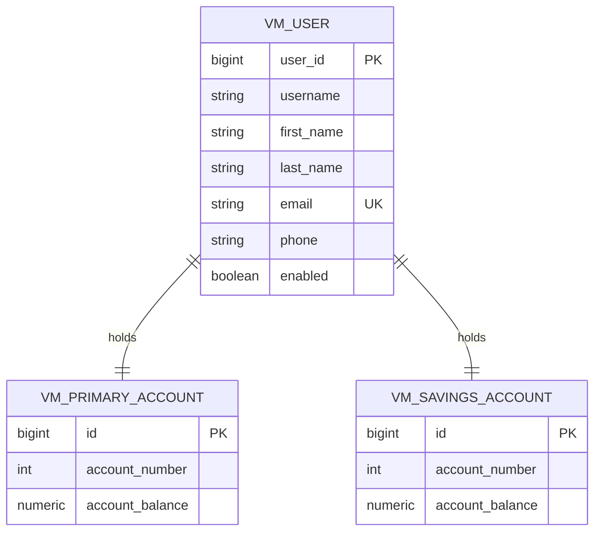

# Virgin Money Source Model

This folder documents the Virgin Money-side source model. As with the Nationwide folder, entity classes live in the unified-api project under the `uk.co.nationwide.unified.virginmoney` package — this folder is reference documentation only.

## Source-of-truth for the model

Adapted from the public open-source [Online-Banking-with-Java-Spring-Boot-Angular-2](https://github.com/COG-GTM/Online-Banking-with-Java-Spring-Boot-Angular-2) reference project, treated here as a proxy for Virgin Money's online-banking stack.

| Domain entity | Upstream class | Java entity in unified-api |
|---|---|---|
| User | `com.userFront.domain.User` | `VmUserEntity.java` |
| Current account | `com.userFront.domain.PrimaryAccount` | `VmPrimaryAccountEntity.java` |
| Savings account | `com.userFront.domain.SavingsAccount` | `VmSavingsAccountEntity.java` |
| Transaction | `com.userFront.domain.PrimaryTransaction` / `SavingsTransaction` | out of scope for scene 3 (see [data-mapping.md](../data-mapping/data-mapping.md)) |

## ER diagram

## Adaptations from the upstream source

- Migrated from `javax.persistence` to `jakarta.persistence` for Spring Boot 3 compatibility.
- Dropped Spring Security `UserDetails` plumbing (not needed for the unified-API read flow).
- Removed `Appointment`, `Recipient`, and `UserRole` — out of scope for the unified API.
- Table names prefixed `vm_` to allow coexistence with Nationwide tables in the same database for the demo.

## Findings the demo highlights

Two upstream defects the demo's data mapping calls out (see [data-mapping.md](../data-mapping/data-mapping.md)):

- `PrimaryTransaction.amount` is a `double` — must be `BigDecimal` for money.
- `PrimaryAccount.accountNumber` / `SavingsAccount.accountNumber` are `int` — should be `String` to preserve leading zeros.

Devin surfaces these as flagged open questions rather than silently fixing them, because changing the source-system contract is a Virgin Money product decision, not an integration-team decision.
