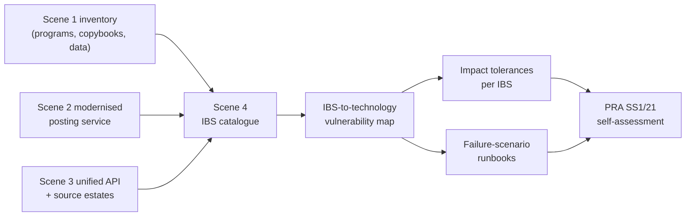

# Scene 4 — Operational Resilience

**The COO question:** *"The PRA wants evidence we can keep important services running through severe-but-plausible disruption — across two technology estates. Where does that evidence come from?"*

This scene takes the combined Nationwide + Virgin Money system from scenes 1–3 and produces the artefacts the COO has to put in front of the board, the CRO, and the PRA.

## What's in this folder

| Folder | Artefact |
|---|---|
| [`ibs-mapping/`](./ibs-mapping/) | Important Business Services (IBS) catalogue per PRA SS1/21, with each IBS mapped to underlying components across both estates. |
| [`dependency-analysis/`](./dependency-analysis/) | Cross-system dependency graph showing which components support which IBS, and which third parties are in the chain. |
| [`runbooks/`](./runbooks/) | Failure-scenario runbooks for the most plausible severe disruptions (VSAM master corruption, payments network failure, account-services DB failover, identity outage). |
| [`pra-evidence/`](./pra-evidence/) | Self-assessment document template (PRA SS1/21 §3-7) and impact-tolerance definitions. |

## How the artefacts relate

This is the bit the regulator cares about — the chain from "we know what we have" → "we know which components matter for the IBS" → "we know what would break it" → "we know how we'd respond" → "here's the evidence."

## What Devin actually did to produce this scene

This scene is more analytical than scenes 1–3. The artefacts in this folder were drafted by Devin from:

- Scene 1's dependency graph (which programs read/write which datasets).
- Scene 2's REST surface for the transaction-posting service.
- Scene 3's unified-API contract and its dependence on both estates.
- The PRA SS1/21 vocabulary, supervisory statement, and the FCA PS6/21 equivalents (see [`../docs/operational-resilience.md`](../docs/operational-resilience.md)).

The point is not that Devin replaces the Operational Resilience team — it isn't going to be accountable to the board. The point is that the OR team's draft work for a single review cycle drops from weeks (mapping spreadsheets by hand) to hours (drafts ready for review). They still own the judgements; Devin owns the keyboard work.

## How to read this in the demo

Walk the audience through it in this order, in 60–90 seconds each:

1. [`ibs-mapping/ibs-catalogue.md`](./ibs-mapping/ibs-catalogue.md) — the three IBS. *"This is what we care about keeping running."*
2. [`dependency-analysis/cross-estate-dependencies.md`](./dependency-analysis/cross-estate-dependencies.md) — which components support each IBS, across both estates. *"This is everything that could break it."*
3. [`runbooks/`](./runbooks/) — pick one runbook (the VSAM corruption one is the most evocative). *"This is how we'd respond."*
4. [`pra-evidence/self-assessment.md`](./pra-evidence/self-assessment.md) — *"This is the document the COO signs."*

## What this demo does *not* claim

- Devin does **not** make the regulatory judgement calls. The impact-tolerance values, what counts as an IBS, who counts as a critical third party — those are the COO/CRO/board's decisions. Devin produces the draft.
- The runbooks are realistic *templates*. Real runbooks reference internal tooling (paging schedules, comms templates, the ops bridge URL) that this demo can't include.
- The PRA self-assessment template is the *structure* the regulator expects, not Nationwide's actual self-assessment.
