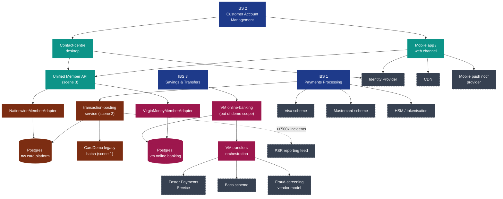

# Cross-Estate Dependency & Vulnerability Map

> Devin-generated draft of the IBS-to-technology vulnerability map required under PRA SS1/21 §3.6–§3.10. Shows every internal component and external third party in the chain supporting each Important Business Service across the Nationwide and Virgin Money estates.

## Vulnerability map (Mermaid)

The diagram below is the single picture the COO walks the board through. It's structured by IBS columns (top), then runs vertically through internal components and external dependencies; the lines show *what supports what*, so a stakeholder can trace from "Payments Processing" down to every external dependency in one read.

## Single points of failure to call out

This map exists so the COO can answer the *"if it broke today, what would happen?"* question for each IBS. Devin highlights the **single points of failure** (SPoF) — components that, if they fail, take an IBS down with no automatic compensating route.

| SPoF | Affected IBS | Why it's a SPoF | Current mitigation | Gap |
|---|---|---|---|---|
| Postgres primary for the modernised card platform | IBS 1, IBS 2 | Single primary; modernised platform writes here | Hot standby in second AZ; tested failover | Failover-RTO not measured against IBS 1 impact tolerance — *open action* |
| CardDemo legacy batch nightly window | IBS 1 (next-day) | Posting batch is single-threaded; if it doesn't complete in window, next-day balances are wrong | Re-run procedure; ops on-call | Re-run procedure is *not* time-bounded against impact tolerance — *open action* |
| Unified Member API | IBS 2 | Single API surface for the digital channel | Stateless; horizontal autoscaling | Adapter-level circuit breakers not implemented — *open action* |
| Identity Provider | IBS 2 | Cross-channel authn dependency | Provider has its own resilience plan | We don't see the IdP's own self-assessment — *raised with vendor management* |
| Faster Payments connection | IBS 3 | Scheme connection; no automatic fallback | Bacs as fallback for standing orders (but not real-time payments) | Bacs is not a real-time substitute for FPS — *known and accepted* |
| Visa scheme connection | IBS 1 | Scheme connection; no automatic fallback to alternative scheme | None (Visa-issued cards can't fall back to Mastercard at runtime) | None — *accepted scheme concentration risk* |

## Third-party concentration

A separate concern under PRA SS1/21 §3.10 is *concentration of critical third parties*. Devin's read:

- **Card schemes (Visa, Mastercard).** Unavoidable concentration; scheme membership is the business. Documented and accepted.
- **Identity Provider.** Cross-estate concentration — used by both Nationwide-side and Virgin Money-side channels. Worth raising with the OR committee: should we tolerate a single IdP for both estates?
- **CDN.** Single CDN for the mobile app and web channel. Documented; consider multi-CDN for IBS 2.
- **HSM / tokenisation vendor.** Single vendor, single contract. Discussion for the Q1 2026 board OR review.

The "open actions" above are the bits that need a *human* judgement — what's the tolerance, what's the mitigation budget, who owns the fix. Devin can keep drafting; it can't decide whether the bank wants to spend £8m on a second IdP.
